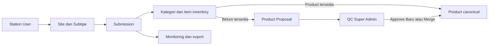

# Overview Sistem

## Status Dokumen

- Baseline source: `1e306ebe683dd5a1cc5c1fe54e9c288727e56331`
- Target pembaca: Developer Aloptama Collect
- Source of truth: source code, tests, dan migrations pada baseline di atas

## Latar Belakang dan Tujuan

Aloptama Collect membantu BMKG mendata metadata Site Aloptama dan perangkat yang terpasang maupun inventaris Gudang. Sistem menyatukan pengisian Station, draft server, QC Product, monitoring completion, ekspor, serta audit administrasi dalam satu aplikasi.

Tujuannya bukan sekadar mengumpulkan form. Sistem menjaga scope Station, menghindari dua editor saling menimpa data, menjaga history Product, dan memberi Super Admin gambaran pengisian tanpa memuat seluruh payload ke browser.

## Aktor Sistem

| Aktor | Tanggung jawab bisnis |
| --- | --- |
| Station User | mengisi Site yang menjadi milik Station akunnya, menyimpan draft, mengusulkan Product yang belum ada |
| Super Admin | melihat Ringkasan, membuka pengisian lintas Station, mengelola akun, QC Produk, Produk canonical, lock, audit, dan ekspor |
| Developer / operator | menjaga source, master, migration, verification, dan deployment |

Detail Auth/RLS dan batas otorisasi dibahas pada dokumentasi lanjutan.

## Konsep Domain Utama

| Istilah | Arti di sistem |
| --- | --- |
| Station | entitas pengelola Site; satu akun Station User terikat ke satu Station |
| Jenis Stasiun | klasifikasi authoritative dari `station_categories`, bukan hasil parsing nama Station |
| Site | lokasi/paket alat milik Station, misalnya AWOS atau Gudang |
| Tipe Site | kategori parent untuk Site |
| Subtipe | konteks pengisian dalam Tipe Site; validitasnya dapat dibatasi per Site |
| Submission | satu record pengisian untuk kombinasi Station + Site + Subtipe |
| Kategori | kelompok inventaris dalam profil perangkat |
| Gudang | Site inventaris khusus; informasional untuk completion, bukan Site normal dalam denominator completeness |
| Product | Brand/Model canonical dalam katalog |
| Product Alias | variasi Brand/Model yang tetap menunjuk ke Product canonical |
| Product Proposal | usulan Brand/Model dari Station ketika tidak ada di katalog |
| QC | proses Super Admin menyelesaikan Product Proposal |
| Direct Reference | `productId` langsung pada item inventory |
| QC Result Reference | item `productProposalId` yang proposalnya sudah di-resolve ke Product canonical |
| Completion / Pengisian | ringkasan seberapa banyak kategori expected yang telah terisi pada konteks yang dinilai |

## Fitur Utama Station User

- Masuk dengan akun Station dan melihat Site yang diizinkan.
- Memilih Site dan Subtipe yang sesuai konfigurasi master live.
- Membuka atau melanjutkan Submission secara bertahap.
- Mengisi metadata Site, perangkat, jumlah, unit, dan kondisi sesuai konteks.
- Menggunakan autosave, simpan manual, soft lock, dan penanganan konflik versi.
- Memilih Product aktif dari katalog atau membuat Product Proposal jika Product belum tersedia.
- Mengisi Gudang dengan mode inventaris yang berbeda dari perangkat terpasang.
- Mengunduh hasil pengisian CSV/JSON sesuai konteks.

## Fitur Utama Super Admin

Navigasi Admin saat ini mencakup:

- Ringkasan monitoring Station dan Tipe Site.
- Stasiun & Pengisian, termasuk master dan Submission.
- Produk canonical beserta penggunaan, dependency, referensi, pemindahan, merge, dan delete guard.
- Akun Stasiun.
- Lock Aktif.
- QC Produk.
- Audit Admin.
- Panduan Super Admin.

## Siklus Data Secara Umum

Tidak setiap Submission membuat Product Proposal. Proposal hanya dibuat ketika user tidak memakai Product canonical yang tersedia.

## Istilah Penting

Beberapa pasangan istilah yang tidak boleh dicampur:

- Product canonical berbeda dari Product Proposal.
- Alias berbeda dari Proposal; alias adalah variasi nama untuk Product canonical.
- Pindahkan Referensi berbeda dari Gabungkan Produk.
- Gudang tampil dalam monitoring, tetapi tidak menentukan status completeness Station.
- Master runtime berbeda dari artifact CSV/generated untuk recovery.

## Source of Truth dan Ownership Data

Supabase adalah source of truth untuk master runtime, akun, Submission, lock, QC, Product, dan audit. Git `main` adalah source of truth source code. Migration adalah sejarah evolusi database yang immutable setelah diterapkan.

Browser menyimpan draf scoped sebagai cadangan, tetapi cadangan browser bukan authority final. Spreadsheet dan CSV hanya boleh dipakai melalui workflow import/recovery yang eksplisit.

## Batas Sistem

Sistem bergantung pada layanan eksternal berikut:

- Supabase untuk Auth dan database.
- `wilayah.id` untuk pilihan wilayah administratif pada form metadata.
- Hostinger untuk runtime Next.js production.
- Cloudflare untuk DNS.
- Vercel untuk Preview branch dan redirect URL legacy.
- GitHub untuk source dan workflow Pull Request.

Sistem tidak mengelola ownership akun Hostinger, Cloudflare, Supabase, atau GitHub. Informasi itu adalah runbook operator.

## Legacy / Compatibility yang Masih Ada

- Legacy Vercel URL tetap redirect 307 ke Hostinger.
- `app/data.generated.json`, CSV, dan Spreadsheet dipertahankan untuk recovery/reference, bukan runtime Station User.
- Payload lama dengan kategori tertentu tetap dinormalisasi agar tidak hilang atau dihitung dua kali.
- Runtime master membawa informasi legacy Submission subtype untuk menahan edit saat konfigurasi Site berubah sampai remediation aman dilakukan.

## Hal yang Sengaja Tidak Dilakukan Sistem

- Tidak menyediakan shared in-memory state Node.js sebagai business state.
- Tidak memuat semua payload Submission untuk daftar monitoring biasa.
- Tidak mem-poll atau memakai realtime agresif untuk lock.
- Tidak menghitung Gudang sebagai kategori completeness Site biasa.
- Tidak menghitung total QC hanya dari daftar browser yang dapat terkena batas pagination.

## Source of Truth untuk Dokumen Ini

- `app/InventoryApp.tsx` -> kemampuan Station User dan Gudang.
- `app/admin/AdminDashboard.tsx` -> navigasi dan kemampuan Super Admin.
- `app/admin/AdminProducts.tsx` -> Product maintenance.
- `app/types/inventory.ts` -> vocabulary Product, Proposal, Site, dan runtime master.
- `app/lib/station-runtime-master.ts` -> master runtime Station.
- `app/lib/warehouse.ts` dan `app/lib/station-completion.ts` -> istilah Gudang/completion.
- `supabase/migrations/20260818120000_multi_super_admin_qc.sql` -> QC concurrent final flow.
- `supabase/migrations/20260905120000_gudang_submission_progress.sql` -> Gudang informational progress.

## Baca Sebelumnya

[Mulai di Sini](./00-MULAI-DI-SINI.md)

## Baca Selanjutnya

[Arsitektur](./02-ARSITEKTUR.md) untuk request path dan batas teknis, lalu [Setup Development](./03-SETUP-DEVELOPMENT.md) untuk menjalankan project.
