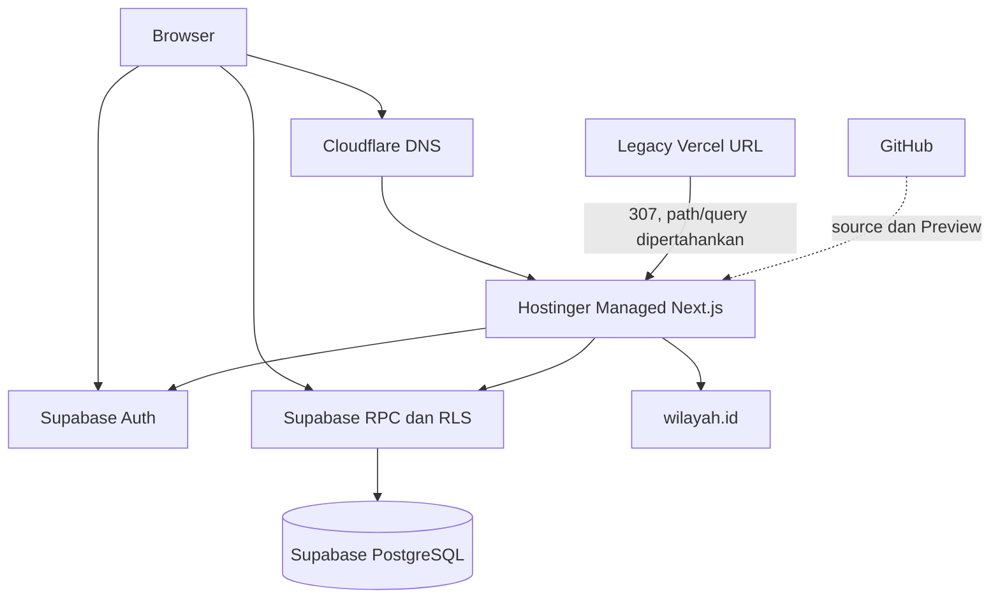
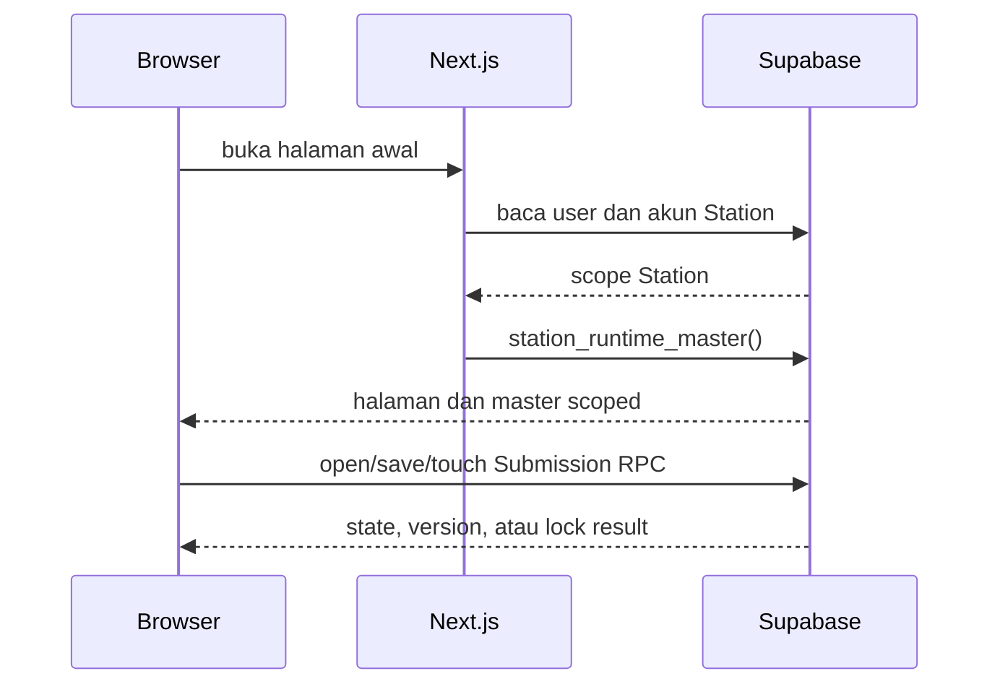

# Arsitektur Sistem

## Status Dokumen

- Baseline source: `1e306ebe683dd5a1cc5c1fe54e9c288727e56331`
- Target pembaca: Developer Aloptama Collect
- Source of truth: source code, tests, dan migrations pada baseline di atas

## Ringkasan

Aloptama Collect adalah aplikasi Next.js dengan dua pola akses backend: sebagian request melewati page/API route Next.js, dan sebagian browser memanggil Supabase langsung menggunakan session pengguna. Supabase memegang state bisnis persisten, Auth, RLS, dan RPC. Jangan menganggap Next.js sebagai satu-satunya backend path.

## Diagram Arsitektur Production

Cloudflare diagram ini menunjukkan peran DNS, bukan application runtime. IP, proxy mode, dan akses akun tidak disimpan di repository.

## Komponen Utama

| Komponen | Tanggung jawab |
| --- | --- |
| Browser / React | form Station, Admin dashboard, local draft, pemanggilan RPC/API |
| Hostinger Managed Next.js | SSR page guard, route handler, production application runtime |
| Supabase Auth | session/cookie dan identity pengguna |
| Supabase PostgreSQL | master, Submission, Product, Proposal, audit |
| Supabase RLS/RPC | final scope dan business operation database |
| wilayah.id | data pilihan wilayah administratif via proxy allowlisted |
| Vercel | Preview branch dan redirect compatibility legacy hostname |
| GitHub | repository, branch, Pull Request, release source |

## Request Path

### Browser -> Hostinger -> Supabase

Gunakan path ini ketika Next.js perlu membaca cookie server, membentuk response API, atau memakai server-only secret secara terbatas.

| User action | Frontend entry | Network path | Backend |
| --- | --- | --- | --- |
| Buka halaman awal | `app/page.tsx` | Browser -> SSR page -> Supabase | `auth.getUser`, `station_accounts`, `station_runtime_master()` |
| Buka Admin | `app/admin/page.tsx` | Browser -> SSR page -> Supabase | `auth.getUser`, `super_admins` |
| Cari catalog Product | `useProductCatalog.ts` | Browser -> `/api/products` -> Supabase | active Products, aliases, canonical resolver |
| Buka monitoring Submission | `AdminSubmissionMonitor.tsx` | Browser -> `/api/admin/submissions` -> Supabase | `admin_list_submissions()` |
| Provision akun Station | `AdminDashboard.tsx` | Browser -> `/api/admin/accounts` -> Supabase | session check, admin check, narrowly scoped service client |

### Browser -> Supabase

Browser memakai publishable Supabase client dan session pengguna untuk operasi yang boundary utamanya berada pada RLS/RPC.

| User action | Frontend entry | Direct call | Boundary utama |
| --- | --- | --- | --- |
| Memuat master Station | `app/page.tsx` / runtime parser | `station_runtime_master()` | account station di database |
| Mulai edit, save, touch lock | `useServerDraft.ts` | submission RPC family | Station scope, session UUID, expected version |
| Melihat progress Site sendiri | `useStationSiteProgress.ts` | `list_station_submission_summaries()` | Station scope |
| QC Admin | `AdminDashboard.tsx` | QC RPC v2 | `require_super_admin()` |
| Ringkasan completion | `AdminDashboard.tsx` | completion summary/detail RPC | `require_super_admin()` |

### External API

`useRegionOptions.ts` memanggil `/api/regions`. Route ini hanya meneruskan path yang cocok dengan allowlist ke `https://wilayah.id/api` dan memasang cache response. Browser tidak menerima kebebasan untuk meminta URL upstream sewenang-wenang.

## API Route Handler

Route handler adalah adapter, bukan pengganti semua business rule database.

- `/api/products` mengemas pencarian Product aktif dan canonical resolution.
- `/api/admin/products/*` memvalidasi request HTTP dan meneruskan mutation penting ke RPC Admin.
- `/api/admin/submissions/*` menyediakan list/detail/administrative operations dan ensure Admin dengan validation server.
- `/api/admin/accounts` memakai service client hanya setelah session pengguna dan role Super Admin diverifikasi.
- `/api/regions` adalah proxy external API terkontrol.

Saat mengubah route handler, audit juga RPC, RLS, caller browser, dan test. Jangan memindahkan business rule ke route handler hanya karena tampak lebih mudah diubah.

## Authentication Boundary

Supabase session hidup pada browser/cookie SSR. `proxy.ts` menyegarkan claim/cookie untuk host normal. Page server memeriksa user sebelum memilih Station UI atau Admin UI. Browser client memakai publishable key; server-only admin client membutuhkan `SUPABASE_SECRET_KEY` dan hanya ada pada route khusus.

Detail login, RLS, dan account mapping dibahas pada dokumentasi Auth lanjutan.

## Database/RPC Boundary

Data persisten adalah milik Supabase. RPC critical memakai authorization database dan banyak di antaranya `SECURITY DEFINER` dengan scope/role check. UI dan API check membantu UX, tetapi bukan alasan untuk menghapus guard dalam RPC atau RLS.

Migration mendefinisikan schema/RPC production. Jangan memperlakukan migration lama sebagai file biasa yang boleh diedit.

## External Services

| Service | Peran | Dampak bila gagal |
| --- | --- | --- |
| Supabase | Auth, data, RLS, RPC | login, master, save, monitoring, QC terganggu |
| Hostinger | Next.js production | SSR/API canonical tidak tersedia |
| Cloudflare | DNS aplikasi | hostname tidak mengarah ke runtime |
| Vercel | Preview dan redirect legacy | Preview/legacy URL terganggu; canonical Hostinger tetap target utama |
| wilayah.id | pilihan wilayah form | input wilayah tidak dapat dimuat; inti Submission tetap terpisah |
| GitHub | source/PR | delivery code terganggu, runtime yang sudah deploy tidak otomatis hilang |

## Deployment Topology

Production canonical mengarah ke Hostinger. Repository membuktikan URL canonical dan compatibility redirect, tetapi tidak menyimpan dashboard deployment Hostinger atau record DNS. Lihat [OP-002, OP-004, dan OP-011](./OPERATOR-INPUT-WORKSHEET.md) untuk ownership, auto-deploy, runtime selection, log/rollback process, serta Cloudflare record/proxy mode.

Supabase migration harus diterapkan dengan gate eksplisit sebelum frontend production yang bergantung pada schema/RPC baru. Preview branch Vercel berguna untuk smoke test UI, tetapi Preview sukses bukan bukti production database atau Hostinger deployment sukses.

## Legacy Vercel Compatibility

`app/lib/legacy-vercel-redirect.ts` mendefinisikan hostname legacy `aloptama-collect.vercel.app` dan canonical Hostinger origin. `proxy.ts` memeriksa hostname tersebut lebih dahulu lalu mengembalikan redirect **307**. Test memastikan `/admin?foo=bar` dan path lain mempertahankan path/query serta Preview/localhost tidak ikut dialihkan.

Jangan mengubah 307 menjadi 308 atau menghapus redirect tanpa keputusan operasional yang sadar terhadap bookmark dan integrasi lama.

## Data Flow Examples

## Architectural Constraints

- Runtime Station classification dan Site/Subtype berasal dari master Supabase; jangan parse nama Station sebagai authority.
- Business state persisten harus berada di Supabase, bukan memory process Node.js atau cache browser.
- Applied migration immutable; perubahan schema memakai migration baru.
- Product canonical identity adalah UUID, bukan Brand/Model text.
- Product Proposal count berasal dari aggregate + pagination server-side, bukan jumlah row browser yang mungkin terkena cap.
- Scope Station, role Admin, version, dan lock harus divalidasi sampai database/RPC.
- Legacy CSV/generated artifact tidak boleh menjadi jalur otomatis untuk menimpa production master.

## Performance-Sensitive Areas

- Completion memakai summary gabungan set-based dan detail Station lazy-load. Jangan kembalikan JSON payload traversal global atau N+1 detail loading.
- Monitoring Submission mengirim metadata list ringan; payload detail lazy-load.
- Product Proposal menggunakan status aggregate plus list paginated agar aman di atas batas default PostgREST.
- Gudang progress pada summary Site Type dihitung set-based dari keberadaan Submission per Station, bukan scan item inventory untuk setiap kartu.

## Source of Truth untuk Dokumen Ini

- `proxy.ts` -> redirect dan refresh session.
- `app/lib/legacy-vercel-redirect.ts` -> hostname dan canonical origin.
- `app/page.tsx`, `app/admin/page.tsx` -> SSR entry boundary.
- `app/lib/supabase/client.ts`, `server.ts`, `admin.ts`, `config.ts` -> client scopes.
- `app/api/` -> Next.js route handlers.
- `app/hooks/useServerDraft.ts` -> direct submission RPC path.
- `app/api/regions/route.ts` -> external API proxy allowlist.
- `supabase/migrations/20260903120000_optimize_station_completion.sql` -> performance constraints.
- `supabase/migrations/20260905120000_gudang_submission_progress.sql` -> Gudang summary semantics.
- `tests/legacy-vercel-redirect.test.mjs` and `tests/station-monitoring.test.mjs` -> architecture contracts.

## Baca Sebelumnya

[Overview Sistem](./01-OVERVIEW-SISTEM.md)

## Baca Selanjutnya

[Setup Development](./03-SETUP-DEVELOPMENT.md) untuk local boot atau [Struktur Codebase](./04-STRUKTUR-CODEBASE.md) untuk memilih source yang perlu dibaca.
