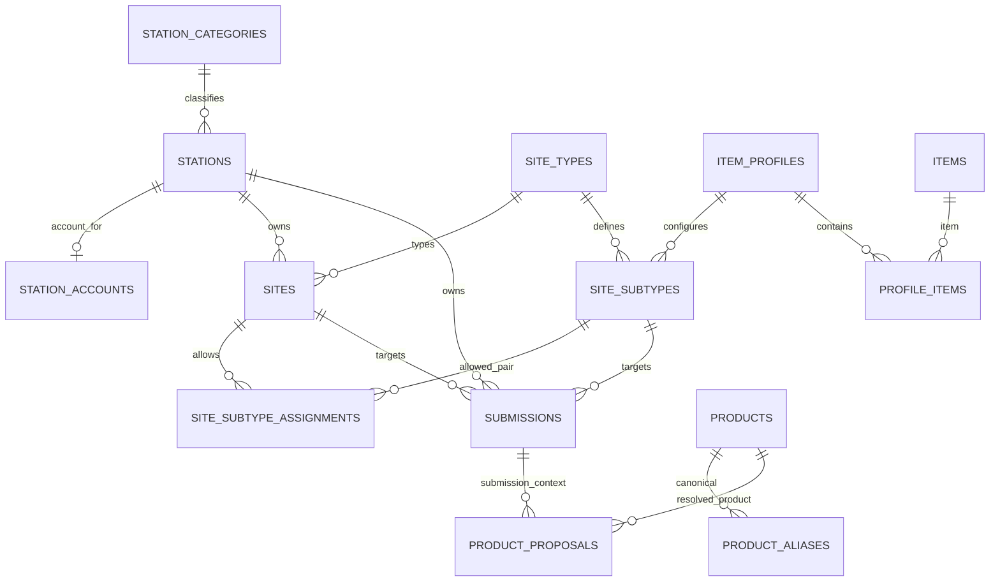

# Database dan Supabase

## Status Dokumen

- Baseline source: `869bc8079c1cd4f5508d4ae41ad2003b431d8566`
- Target pembaca: Developer Aloptama Collect
- Source of truth: source code, tests, dan migrations pada baseline di atas

## Peran Supabase dalam Sistem

Supabase menyediakan Supabase Auth, PostgreSQL, Row Level Security (RLS), dan RPC/function database. Untuk data runtime, Supabase production adalah sumber kebenaran untuk master, account, Submission, soft lock, Product QC, dan audit.

Ini berbeda dari komponen hosting:

- Hostinger menjalankan Next.js production.
- Cloudflare menangani DNS secara operasional.
- Vercel hanya melayani URL legacy yang dialihkan oleh aplikasi ke hostname canonical.

## Source of Truth

`stations`, master Site, account, Submission, dan Product runtime dibaca dari Supabase. Spreadsheet/CSV dan `app/data.generated.json` adalah artefak legacy untuk import, recovery, generator, atau test; bukan instruksi untuk menyinkronkan runtime kembali ke Spreadsheet.

Kolom provenance seperti `products.source_origin` dan `products.spreadsheet_synced` menjelaskan asal data historis. Kolom tersebut tidak mengubah sumber kebenaran runtime.

## Gambaran Model Data

Semua primary key utama menggunakan UUID. Master Site membentuk konteks pengisian; `submissions` menjadi agregat data pengisian; Product dan Proposal Product menangani katalog serta QC.

Panah `PRODUCT_PROPOSALS -> PRODUCTS` hanya berlaku setelah proposal APPROVED atau MERGED melalui `resolved_product_id`. Referensi Product pada item inventory bukan FK SQL: ia hidup di `submissions.payload.inventory` sebagai `productId` atau `productProposalId`.

## Data Dictionary Tabel Inti

| Table | Purpose | Primary Key | Major FK/relation | Current/Historical | Typical writer |
| --- | --- | --- | --- | --- | --- |
| `station_categories` | klasifikasi Station authoritative | `id` | dipakai `stations.station_category_id` | current | master/admin data |
| `stations` | Station pemilik Site dan Submission | `id` | category | current | master/admin data |
| `station_accounts` | satu Auth user ke satu Station aktif | `id` | `auth_user_id`, `station_id` | current | provisioning/Admin |
| `site_types` | parent Tipe Site | `id` | dipakai Site/Subtipe | current | master |
| `sites` | Site milik Station | `id` | `station_id`, `site_type_id` | current | master |
| `site_subtypes` | Subtipe serta Item Profile yang dipakai | `id` | `site_type_id`, `item_profile_id` | current | master |
| `site_subtype_assignments` | allowed pair Site/Subtipe untuk tipe yang memerlukannya | `(site_id, site_subtype_id)` | Site dan Subtipe dengan Tipe Site sama | current | master |
| `item_profiles` | kumpulan kategori inventaris yang diharapkan | `id` | dipakai Subtipe | current | master |
| `items` | kategori/item master | `id` | dipakai `profile_items` | current | master |
| `profile_items` | mapping Profile ke item/kategori aktif | `id` | `item_profile_id`, `item_id` | current | master |
| `product_categories` | registry legacy/export kategori Product | `id` | tidak menjadi sumber kategori runtime Station | legacy/support | master/recovery |
| `submissions` | agregat satu Station, Site, dan Subtipe | `id` | `station_id`, `site_id`, `site_subtype_id` | current | RPC save/Admin |
| `products` | Product canonical Brand/Model | `id` | alias, proposal resolution, JSON reference | current | QC/Admin Product |
| `product_aliases` | Brand/Model alternatif ke Product canonical | `id` | `product_id` | current | QC/edit/merge |
| `product_proposals` | usulan custom Product dan riwayat QC | `id` | `station_id`, `submission_id`, `resolved_product_id` | current | Station RPC/QC |
| `super_admins` | Auth user yang berwenang sebagai Super Admin | `id` | `auth_user_id` | current | provisioning |
| `admin_audit_log` | jejak operasi administrasi | `id` | `admin_auth_user_id` dan target polymorphic | current | Admin RPC/API |

## Ownership dan Scope Data

Station category selalu berasal dari relasi `stations.station_category_id -> station_categories.id`; jangan infer dari nama Station. `station_accounts` mengikat `auth.users.id` ke tepat satu `stations.id`. `sites` berada dalam Station tersebut, lalu Subtipe harus sesuai Tipe Site dan, bila diwajibkan, mempunyai row aktif pada `site_subtype_assignments`.

## Submission sebagai Agregat Utama

Satu row `submissions` mempunyai unique key `(station_id, site_id, site_subtype_id)`. Kolom lifecycle utama:

| Column | Fungsi |
| --- | --- |
| `id` | UUID Submission yang stabil |
| `station_id`, `site_id`, `site_subtype_id` | identity dan scope relasional |
| `payload` | JSON object metadata, inventory, runway azimuth, dan context form |
| `version` | counter optimistic concurrency |
| `operator_name` | operator pada save terakhir |
| `locked_by_session_id` | pemilik soft lock per tab/browser |
| `lock_operator_name`, `lock_last_activity_at` | informasi dan expiry soft lock |
| `last_saved_at`, `created_at`, `updated_at` | timestamp lifecycle |
| `archived_at`, `archived_by`, `archive_reason` | state historis/arsip |

Tidak ada tabel lock terpisah. Soft lock disimpan langsung pada `submissions`. Submission active memiliki `archived_at IS NULL`; archive menyimpan history dan tidak dihapus dari database hanya karena tidak muncul di flow Station normal.

## Product / Proposal Relationship Overview

`products.id` adalah identitas canonical. `product_aliases` menjaga variasi nama tetap menunjuk Product canonical. `product_proposals` menampung Brand/Model mentah yang belum ada di katalog dan, setelah QC, dapat memiliki `resolved_product_id`.

- DIRECT Product reference: item JSON inventory dengan `productId`.
- QC_RESULT reference: item JSON dengan `productProposalId`; proposal APPROVED/MERGED mengarah ke canonical Product melalui `resolved_product_id`.

Jangan menyamakan occurrence JSON dengan relasi FK. Menyelesaikan QC tidak mengharuskan rewrite seluruh payload Submission.

## RPC dan Database Functions

RPC merupakan boundary penting, tetapi bukan satu-satunya tempat business logic. Katalog ringkas berikut adalah kontrak yang umum dipakai.

| Group | RPC contoh | Read/Write | Called from | Tables utama |
| --- | --- | --- | --- | --- |
| Station scope/master | `current_station_id`, `station_runtime_master`, `site_subtype_is_allowed` | read | SSR Station, browser RPC | account/master Site |
| Station Submission | `get_submission_state`, `open_submission`, `save_submission`, `touch_submission_lock`, `release_submission_lock`, `takeover_submission_lock` | mixed | `useServerDraft.ts` | submissions |
| Admin Submission | `admin_open_submission`, `admin_save_submission`, `admin_list_submissions`, `admin_get_submission_detail` | mixed | Admin/API | submissions, master |
| Completion | `admin_completion_monitoring_summary`, `admin_station_completion_detail`, `station_completion_rows` | read | Admin/Station monitoring | master + Submission JSON |
| QC | `admin_list_product_proposals`, `admin_product_proposal_status_summary`, approve/merge/reject `_v2` | mixed | Admin QC | proposals, products, aliases |
| Product | `admin_list_products`, `admin_product_dependencies`, `admin_product_references` | read | Admin Products API | products, proposals, Submission JSON |
| Reference maintenance | `admin_product_reference_move_preflight`, `admin_move_product_references`, `admin_product_merge_preflight`, `admin_merge_product`, `admin_product_delete_preflight`, `admin_delete_product` | mixed | Admin Product API | products, aliases, proposals, submissions |

Representative boundary: browser UI chooses an action; Next.js API validates the authenticated request where API exists; RPC validates scope or Super Admin; RLS and grants protect direct access. Station save/lock flows call RPC from browser directly, so the RPC must independently enforce station scope.

## RLS dan Database Security Boundary

RLS protects direct table reads according to authenticated identity and role policies. Critical mutation functions are `SECURITY DEFINER` with an empty `search_path`, revoke broad execution, and grant only intended authenticated callers. Station RPC derives Station from `auth.uid()`; Admin RPC calls `require_super_admin()`.

RLS is not a reason to remove API authentication. API routes must still establish the actual session and map authorization errors safely before they call privileged operations.

## Migration Model

Migration berada di `supabase/migrations/`. Migration yang sudah diterapkan ke production bersifat immutable dalam workflow ini. Perubahan berikutnya dibuat sebagai migration baru, termasuk bila sebuah RPC perlu diganti.

Alur konseptual yang aman: buat migration additive/replacement, reset/local apply, jalankan verifier domain, audit backward compatibility, lalu terapkan dengan gate production eksplisit. Jangan edit migration lama untuk mengubah production history.

## Migration Milestones

| Domain | Key migration | Final behavior established |
| --- | --- | --- |
| Master Station/Site | `20260809190000_master_data.sql` | UUID master, master relations, base RLS |
| Auth/Submission | `20260810010000_station_auth_autosave.sql` | Station scope, versioning, soft lock, Station RPC |
| Admin/QC | `20260810170000_super_admin_product_qc.sql`, `20260818120000_multi_super_admin_qc.sql` | Super Admin, Proposal QC, audit, concurrency-aware QC |
| Archive/monitoring | `20260812120000_admin_submission_monitoring.sql` | Submission archive and Admin monitoring |
| Runtime master | `20260820120000_station_runtime_master.sql` | Station runtime master from Supabase |
| Site/Subtipe guard | `20260826120000_open_submission_site_subtype_validation.sql` | authoritative pair validation on open/save |
| Completion/Gudang | `20260827120000_station_completion_engine.sql` through `20260905120000_gudang_submission_progress.sql` | current completion and Gudang informational progress |
| Product references | `20260821120000_product_reference_preflight.sql` through `20260901120000_product_reference_move_qc_results.sql` | dependencies, selected move, merge, guarded delete, QC_RESULT references |
| Performance/QC list | `20260902120000_admin_product_proposal_status_summary.sql`, `20260902130000_admin_list_product_proposals.sql`, `20260903120000_optimize_station_completion.sql` | aggregate count, server pagination, set-based completion |

Newer `create or replace function` definitions supersede older function bodies. Inspect the latest defining migration and the consumer test, not only the first migration that introduced an RPC.

## Local vs Production Database

Supabase local uses PostgreSQL at `127.0.0.1:54322` in `supabase/config.toml`. Development mutation verifiers target local/disposable database only. Production must be treated read-only unless a task explicitly authorizes a reviewed mutation.

Use environment variable names only: `SUPABASE_LOCAL_DB_URL`, `SUPABASE_DB_URL`, and preferred trusted remote `SUPABASE_DB_POOLER_URL`. Never place their values in docs, source, or logs.

## Query / Performance Guardrails

- Do not count Product Proposal status from a capped client list; use the database-wide aggregate RPC.
- Do not restore repeated global JSON traversal for completion; current combined completion work is set-based.
- Avoid N+1 Station/Site/Submission/reference queries; use the batch RPC/query shape already established.
- Use set-based SQL for Gudang progress and preserve its distinct informational semantics.
- Filter/search/sort before server-side pagination; do not fetch full Product or QC datasets to paginate in browser.

## Legacy dan Compatibility Data

| Construct | Classification | Current treatment |
| --- | --- | --- |
| Spreadsheet provenance fields | active compatibility | provenance only, not runtime authority |
| `app/data.generated.json` | recovery/test artifact | never Station runtime source |
| category aliases | active compatibility | central canonicalization accepts approved legacy key while new save uses canonical key |
| inactive master/history rows | historical/current safety | retain identity/history; runtime filters active context |
| archived Submission | historical | excluded from active Station workflow but retained for Admin history |

## Cara Menemukan Schema yang Benar

1. Temukan current caller in `app/`, `app/api/`, or hook.
2. Find the latest migration that defines the table/function.
3. Read the closest regression test/verifier.
4. Check grants/RLS when changing a database-facing path.
5. Treat an old migration comment as history until current consumer confirms it.

## Hal yang Tidak Boleh Dilakukan

- Jangan menjalankan mutation verifier pada production.
- Jangan edit migration yang telah diterapkan.
- Jangan infer Station category dari nama Station.
- Jangan menggambar JSON Product reference sebagai FK yang tidak ada.
- Jangan menghapus soft lock dengan mencari tabel lock.
- Jangan menganggap Product QC resolution sama dengan rewrite payload global.

## Source of Truth untuk Dokumen Ini

- `supabase/migrations/20260809190000_master_data.sql` - master, Submission, Station scope, lock RPC awal.
- `supabase/migrations/20260812120000_admin_submission_monitoring.sql` - archive/history.
- `supabase/migrations/20260820120000_station_runtime_master.sql` - master runtime Station.
- `supabase/migrations/20260826120000_open_submission_site_subtype_validation.sql` - authoritative Site/Subtipe guard.
- `supabase/migrations/20260902120000_admin_product_proposal_status_summary.sql`, `20260902130000_admin_list_product_proposals.sql`, `20260903120000_optimize_station_completion.sql`, `20260905120000_gudang_submission_progress.sql` - current scale/summary behavior.
- `app/lib/station-runtime-master.ts`, `app/lib/admin-inventory-master.ts` - runtime master conversion.
- `tests/auth-autosave.test.mjs`, `tests/station-runtime-master.test.mjs`, `tests/product-dependencies.test.mjs`, `tests/station-completion-engine.test.mjs` - current contracts.

## Baca Sebelumnya

[Struktur Codebase](./04-STRUKTUR-CODEBASE.md)

## Baca Selanjutnya

[Authentication dan Otorisasi](./06-AUTH-DAN-OTORISASI.md)
