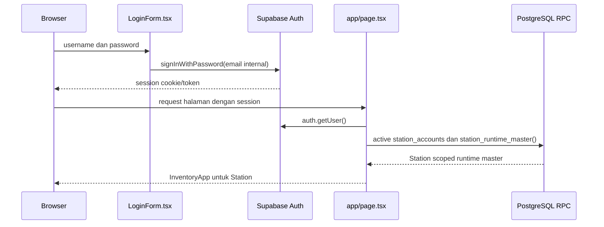
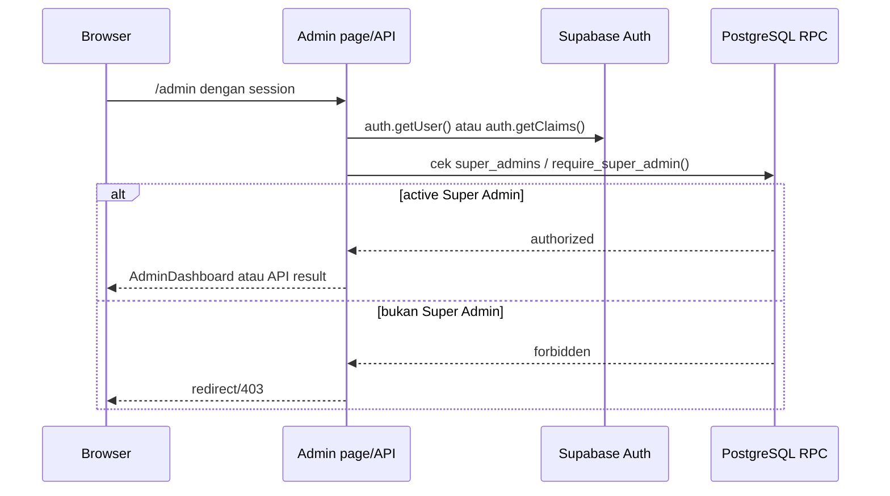

# Authentication dan Otorisasi

## Status Dokumen

- Baseline source: `869bc8079c1cd4f5508d4ae41ad2003b431d8566`
- Target pembaca: Developer Aloptama Collect
- Source of truth: source code, tests, dan migrations pada baseline di atas

## Gambaran Umum

Aloptama Collect memakai Supabase Auth untuk identity/session. Setelah identity tersedia, aplikasi membedakan dua aktor operasional melalui data relasional dan database authorization:

- **Station User**: identity memiliki `station_accounts` aktif dan dibatasi pada satu Station.
- **Super Admin**: identity memiliki row aktif pada `super_admins` dan dapat menjalankan operation Admin yang dilindungi.

Keduanya bukan role frontend. Menu/SSR guard membantu navigasi, sedangkan scope akhir harus divalidasi API/RPC/RLS.

## Aktor dan Role

| Actor | Account relation | Scope kerja | Final authorization utama |
| --- | --- | --- | --- |
| Station User | `station_accounts.auth_user_id -> auth.users.id` | satu `station_id` aktif | `current_station_id`, `require_submission_scope`, RLS |
| Super Admin | `super_admins.auth_user_id -> auth.users.id` | lintas Station sesuai RPC/API | `require_super_admin()` dan RLS/grant |

`station_accounts.role` saat ini dibatasi ke nilai `station`; jangan mengasumsikan claim JWT bernama role. `super_admins` adalah relasi authorization yang terpisah.

## Station User Login Flow

`LoginForm.tsx` menerima username dan password. Helper `stationEmailForUsername()` menormalisasi username lalu membentuk email internal pada domain `stations.aloptama.internal`; browser client menjalankan `signInWithPassword`.



`app/page.tsx` menjalankan SSR account resolution. Master runtime Station diperoleh dari `station_runtime_master()` yang scoped oleh `auth.uid()`, bukan dari `data.generated.json`.

## Super Admin Login Flow

Super Admin menggunakan Supabase Auth session yang sama secara teknis, tetapi page `/admin` dan RPC Admin menguji membership `super_admins` aktif. Super Admin tidak memperoleh akses hanya karena tampilan Admin dibuka atau karena username menyerupai akun tertentu.



API yang memakai service client tetap memvalidasi session pengguna dan Super Admin lebih dahulu. Secret client hanya alat server untuk operation terbatas, bukan pengganti identity caller.

## Session dan Cookie

`@supabase/ssr` dipakai untuk browser dan server contexts.

- `app/lib/supabase/client.ts`: singleton browser client dengan publishable key.
- `app/lib/supabase/server.ts`: server client membaca/menulis cookies melalui Next.js `cookies()`.
- `proxy.ts`: pada hostname non-legacy memanggil `auth.getClaims()` agar claims/cookie dapat direfresh.

Cookie bersifat host-only dalam praktik browser. Session pada `aloptama-collect.vercel.app` tidak dibagikan ke `aloptama-collect.azkahariz.com`; sesudah berpindah hostname pengguna perlu login kembali. Jangan membuat asumsi callback OAuth karena aplikasi current memakai password flow dan source tidak membuktikan OAuth/magic-link runtime flow.

## Browser Supabase Client

Browser client memakai `NEXT_PUBLIC_SUPABASE_URL` dan `NEXT_PUBLIC_SUPABASE_PUBLISHABLE_KEY`. Ia dipakai untuk authenticated RLS read dan RPC seperti open/save/touch/release Submission. Browser tidak boleh memiliki `SUPABASE_SECRET_KEY`.

## Server Supabase Client

Server client memakai konfigurasi public yang sama, tetapi membawa cookies request. Ia dipakai pada Server Component/page guard dan route handler agar Supabase dapat mengetahui session aktual. Kegagalan konfigurasi public menyebabkan helper mengembalikan `null`; caller harus menangani sebagai configuration error, bukan membuat client palsu.

## Station Scope Resolution

Path authorization Station adalah:

```text
auth.uid()
-> station_accounts (active)
-> current_station_id()
-> sites.station_id dan Site/Subtipe valid
-> Submission scoped RPC/RLS
```

`require_submission_scope(p_site_id, p_site_subtype_id)` memvalidasi bahwa Site aktif milik Station current dan `site_subtype_is_allowed()` menerima pasangan tersebut. Trigger `submissions_validate_site_subtype` memberi proteksi kedua saat insert/update relation Submission.

Frontend filtering adalah UX saja. Jangan menggantikan scope RPC dengan `stationId` dari state browser.

## Super Admin Scope

Admin RPC yang penting memanggil `require_super_admin()`. Route API biasanya lebih dahulu menjalankan `auth.getUser()` untuk menolak request tanpa session, lalu RPC menjadi boundary otoritas akhir. PostgreSQL error `42501` harus dipetakan sebagai forbidden pada API, bukan dikirimkan sebagai raw database error.

## API Route Authorization

| Route/flow | Actor | Auth method | Scope check |
| --- | --- | --- | --- |
| `GET /api/products` | authenticated user | server session `auth.getUser()` | RLS/catalog active read |
| Station Submission RPC | Station User | browser session | `current_station_id` dan `require_submission_scope` |
| `/api/admin/submissions` | Super Admin | server `auth.getUser()` | `admin_*` RPC calls `require_super_admin()` |
| `/api/admin/product-proposals` | Super Admin | server session | Admin summary/list RPC authorization |
| `/api/admin/products/*` | Super Admin | server session | Product Admin RPC authorization |
| `/api/admin/runtime-master` | Super Admin | server session | active `super_admins` check |
| `/api/admin/accounts` | Super Admin | actual session or bearer session | `is_super_admin`; then narrow service action |
| `/api/admin/submissions/ensure` | Super Admin | actual session | Admin check, service client, subtype guard |

Exact API implementation can differ between browser-RPC and Hostinger route paths. Always read the route and called RPC together before changing authorization.

## RLS dan Database Boundary

RLS restricts direct table access by authenticated identity, notably Station account/Submission reads. `SECURITY DEFINER` RPCs perform scoped checks and have explicit execution grants. Service-key code bypasses normal RLS by design, so it must be server-only and preceded by real user authorization.

The database remains the final boundary for a direct RPC caller; the API remains responsible for session validation, input parsing, error mapping, and privileged action scope.

## SUPABASE_SECRET_KEY

`SUPABASE_SECRET_KEY` is **server only**. `app/lib/supabase/admin.ts` is marked `server-only` and creates a non-persistent admin client only when the secret exists.

Current server-secret consumers include Admin account provisioning/reset/activation and Admin Submission ensure paths. Never:

- prefix it with `NEXT_PUBLIC_`;
- import the admin client from browser code;
- send it in a request/response;
- commit it, print it, or copy it into documentation.

## Logout dan Session Refresh

Station logout releases only the current `sessionStorage` tab session lock as best effort before calling `supabase.auth.signOut({ scope: "local" })`. A network failure must not block logout forever; the five-minute lock expiry remains fallback. Local sign-out prevents one browser/device from logging out other devices that use the same Station account.

`proxy.ts` refreshes claims/cookies on normal hosts. It is not an application authorization substitute and it must not acquire/release Submission locks.

## Hostname / Domain Behavior

The canonical production hostname is `aloptama-collect.azkahariz.com`. `legacyVercelRedirectDestination()` recognizes only `aloptama-collect.vercel.app`; `proxy.ts` returns HTTP 307 before session refresh and preserves path/query. Preview, localhost, and non-legacy hostnames continue through normal application behavior.

Because the redirect moves to another hostname, prior legacy host cookies are not shared. This is expected, not an auth corruption symptom.

## Threat Model Praktis

| Risk | Control current |
| --- | --- |
| user memilih Station lain di browser | station scope derived from `auth.uid()` in RPC |
| Station User calls Admin route | session plus Admin RPC/role check returns forbidden |
| stale tab overwrites newer Submission | expected `version` check in save RPC |
| one shared Station account has two devices | per-tab session UUID and local-scope logout |
| service key reaches browser | `server-only` admin client and no public variable |
| legacy host session appears lost | host cookie isolation; user reauthenticates canonical host |

## Hal yang Tidak Boleh Dilakukan

- Jangan menyimpan role hanya di React state atau mengandalkan hidden menu.
- Jangan menggunakan `getSession()` sebagai pengganti server authorization `auth.getUser()` pada route protected.
- Jangan memanggil global sign-out untuk logout Station biasa.
- Jangan membuat RPC release-all-locks berdasarkan auth user.
- Jangan melewati `require_submission_scope` atau `require_super_admin()` demi UI shortcut.
- Jangan expose service key atau connection secret.

## Debugging Auth Singkat

| Symptom | First check |
| --- | --- |
| login gagal | `LoginForm.tsx`, normalization username, response Supabase Auth |
| API 401 | route `auth.getUser()` dan cookie canonical hostname |
| Station melihat Site salah | `station_accounts`, `current_station_id`, `station_runtime_master` |
| Admin mendapat 403 | active `super_admins` row dan `require_super_admin()` result |
| session hilang setelah redirect | hostname berubah; login ulang canonical host |
| route admin 503 config | presence variable names, never print values |

## Source of Truth untuk Dokumen Ini

- `app/LoginForm.tsx`, `app/lib/auth.ts` - username ke internal email dan password login.
- `app/page.tsx`, `app/admin/page.tsx` - SSR role routing.
- `app/lib/supabase/client.ts`, `server.ts`, `admin.ts`, `config.ts` - client contexts and key boundaries.
- `proxy.ts`, `app/lib/legacy-vercel-redirect.ts` - cookie refresh and legacy redirect order.
- `app/api/admin/accounts/route.ts`, `app/api/admin/submissions/ensure/route.ts` - privileged API examples.
- `supabase/migrations/20260810010000_station_auth_autosave.sql`, `20260810170000_super_admin_product_qc.sql`, `20260826120000_open_submission_site_subtype_validation.sql` - scope/RLS/RPC rules.
- `tests/auth-autosave.test.mjs`, `tests/legacy-vercel-redirect.test.mjs`, `tests/site-subtype-family.test.mjs` - regression contracts.

## Baca Sebelumnya

[Database dan Supabase](./05-DATABASE-SUPABASE.md)

## Baca Selanjutnya

[Flow Station dan Submission](./07-FLOW-STATION-DAN-SUBMISSION.md)
