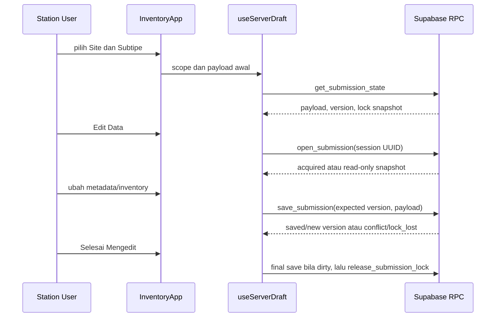

# Flow Station dan Submission

## Status Dokumen

- Baseline source: `869bc8079c1cd4f5508d4ae41ad2003b431d8566`
- Target pembaca: Developer Aloptama Collect
- Source of truth: source code, tests, dan migrations pada baseline di atas

## Ringkasan Lifecycle

Station User memilih Site dan Subtipe dari runtime master scoped, membuka state Submission, lalu secara eksplisit memperoleh soft lock sebelum edit. Draft disimpan lokal terlebih dahulu, kemudian autosave atau save final menulis payload dengan expected version. Product yang tidak ada di katalog dibuat sebagai Proposal, bukan Product canonical langsung.



Tidak semua field wajib dan Proposal Product hanya muncul ketika user mengusulkan Product baru. Browse/read-only tidak otomatis mengambil lock.

## Station -> Site -> Subtipe -> Submission

Runtime master Station berisi `stationId`, Site aktif milik Station, Subtipe aktif, Item Profile, dan Profile Item. `InventoryApp.tsx` membangun scope:

```text
stationId + siteId + siteSubtypeId
```

Submission mempunyai satu identity current per kombinasi tersebut melalui unique key database. Validasi database memastikan Site berada di Station current dan Subtipe allowed untuk Site/Tipe Site current. Untuk Site Type yang memakai assignment eksplisit, `site_subtype_assignments` menentukan Subtipe yang boleh dibuka.

## Membuka / Memastikan Submission

Untuk Station User, lifecycle read dan edit terpisah:

1. `get_submission_state` membaca Submission current dan snapshot lock tanpa membuat row atau lock.
2. `open_submission` dipanggil saat user memilih Edit Data. RPC melakukan `insert ... on conflict do nothing` untuk memastikan row `(station_id, site_id, site_subtype_id)` tersedia, kemudian mengunci row dan mencoba memperoleh lock.
3. Jika session lain masih aktif, response memberi payload/version terbaru tetapi `can_edit` false. Client tetap browse/read-only dan explicit retry menjalankan RPC baru, bukan memakai state lock lama.

Admin memiliki route/API ensure dan RPC Admin terpisah untuk membuka Submission lintas Station, tetapi tetap menjalankan authorisasi Super Admin dan validation pair yang sama.

## Struktur Submission

Kolom relasional menyimpan identity dan lifecycle database. Business form berada pada `payload` JSON object.

| Layer | Isi |
| --- | --- |
| relational | `id`, `station_id`, `site_id`, `site_subtype_id`, `version`, archive/lock/timestamp |
| JSON payload | `schemaVersion`, context IDs, `inventory`, `runwayAzimuth`, `siteMetadata` |
| browser local draft | payload, server version terakhir, timestamp lokal |

Contoh sintetis, bukan payload production:

```json
{
  "schemaVersion": 1,
  "stationId": "station-uuid",
  "siteId": "site-uuid",
  "siteSubtypeId": "subtype-uuid",
  "runwayAzimuth": "24",
  "siteMetadata": {},
  "inventory": {
    "Sensor": [
      {
        "id": "item-local-id",
        "itemKind": "product",
        "productId": "product-uuid",
        "brand": "Contoh Merk",
        "model": "Contoh Tipe",
        "quantity": 1,
        "units": []
      }
    ]
  }
}
```

## Metadata dan Inventory

`siteMetadata` menyimpan data metadata Site. `inventory` adalah object dengan key kategori dan value array `InstalledItem`. Item dapat membawa quantity, unit detail per jumlah, condition/year/notes, material, dan function category IDs. Field lama seperti serial/condition/year pada level item masih dibaca untuk compatibility draf lama.

Gudang memakai payload yang sama secara teknis, tetapi progress Gudang memiliki semantics informational tersendiri. Jangan memakai detail Gudang untuk mengubah formula completion Site biasa.

## Kategori dan Item

Kategori yang valid berasal dari Item Profile Subtipe, lalu Profile Item master. `app/lib/category-identity.ts` menyediakan canonicalization untuk compatibility satu alias kategori legacy yang disetujui. Current reader menerima canonical key dan alias legacy; save baru harus menjaga key canonical, bukan memperbanyak variasi nama.

## Product dan Product Proposal dalam Payload

| Field item | Arti |
| --- | --- |
| `productId` | referensi langsung ke `products.id` canonical |
| `productProposalId` | referensi ke `product_proposals.id` untuk Product custom/QC |
| `proposalStatus` | state yang ditampilkan client, termasuk `PENDING_LOCAL` sebelum ada record DB |

Proposal APPROVED/MERGED mendapatkan `resolved_product_id` di tabel proposal. Payload tidak perlu direwrite hanya karena QC selesai; reference itu tetap QC_RESULT dan resolver menggunakan proposal untuk menemukan Product canonical.

## Edit Mode

`useServerDraft.ts` membedakan `browsing`, `opening`, `editing`, `saving`, `saved`, `read-only`, `conflict`, dan `local-only`. `retryAcquireEdit()` membersihkan snapshot lock/error lama lalu selalu memanggil `open_submission`/`admin_open_submission` terbaru.

Draft browser discope dengan key `stationId::siteId::siteSubtypeId`; tab session UUID disimpan pada `sessionStorage`. Initial draft memilih payload server atau local berdasarkan server version dan fingerprint. Bila keduanya berbeda pada version yang tidak cocok, client masuk conflict agar tidak menimpa data server tanpa tindakan sadar.

## Autosave

Saat edit dan payload dirty, hook menulis scoped local draft terlebih dahulu. Autosave memakai debounce 5 detik dan max wait 18 detik dari perubahan pertama yang masih dirty. Request autosave dan manual save memakai `save_submission`/`admin_save_submission` yang sama, dengan `p_expected_version` dari ref client.

Jika browser Supabase client tidak tersedia atau RPC gagal, state menjadi `local-only`; data lokal tetap dipertahankan. Ini bukan bukti bahwa server telah menyimpan data.

## Manual Save

`saveNow()` memaksa attempt segera pada payload dirty. Hasil penting:

- `saved`: server menaikkan version dan client memperbarui local draft version.
- `skipped`: tidak ada perubahan atau scope tidak lagi current.
- `conflict`: server version berbeda; client memuat state terbaru.
- `read-only`: session tidak lagi memegang lock.
- `local-only`: client/RPC tidak tersedia atau request gagal.

`finishEditing()` menjalankan final save bila dirty, lalu release lock. Bila release gagal, flow mengembalikan `release-pending`; UI tidak boleh mengklaim release server sudah sukses.

## Versioning

`submissions.version` adalah counter optimistic concurrency. Normal save yang diterima menaikkan `version` satu. Save memeriksa `p_expected_version`; bila tidak sama, RPC mengembalikan `version_conflict` dan payload baru tidak ditulis.

Operation Admin tertentu yang secara sengaja mengubah item payload, seperti Product reference move atau Product merge, juga menaikkan version Submission yang disentuh. QC-only resolution dapat mengubah `resolved_product_id` tanpa mengubah payload Submission. Jangan menyimpulkan semua operation Product menaikkan Submission version.

## Optimistic / Stale Write Protection

Stale protection mempunyai dua lapis: expected version dan current lock session. Pada conflict, `useServerDraft` memanggil `get_submission_state`/`admin_get_submission_state`, menyimpan payload terbaru sebagai `latestPayload`, dan menahan edit normal sampai user memilih recovery/reload yang tersedia. Client tidak boleh silently retry dengan version baru dan payload lama.

## Soft Lock

Soft lock adalah koordinasi editor, bukan authorization. Lock berada pada row `submissions`:

| Column | Semantics |
| --- | --- |
| `locked_by_session_id` | UUID session per tab/browser yang memegang lock |
| `lock_operator_name` | nama operator untuk UI read-only |
| `lock_last_activity_at` | waktu aktivitas terakhir untuk expiry |

`open_submission` memperoleh lock ketika kosong atau sudah dimiliki session sama. `takeover_submission_lock` hanya dapat memperoleh lock lain yang sudah stale. `release_submission_lock` hanya menghapus row lock jika `locked_by_session_id` sama dengan session current. Tidak ada release-all by auth user.

## Lock Heartbeat

`touchActivity()` dipanggil oleh editor selama edit. Hook membatasi touch menjadi paling sering sekali setiap 45 detik. RPC `touch_submission_lock` hanya memperbarui row dengan session current dan activity yang belum lebih dari lima menit. Heartbeat harus tetap scoped dan rendah biaya; jangan mengubahnya menjadi polling global.

## Lock Release dan Stale Lock

Lock dianggap stale setelah aktivitas lebih dari lima menit. Ini adalah fallback untuk tab/browser crash, network drop, atau editor yang meninggalkan page. Explicit logout dan Selesai Mengedit mencoba release dahulu; kegagalan jaringan tidak boleh membuat logout macet dan expiry tetap menjadi fallback.

Jika user lain selesai edit, user read-only harus memakai Coba lagi/Edit Data. Attempt tersebut harus acquire state database terbaru, termasuk payload/version terbaru jika acquire berhasil.

## Product Proposal Creation

Saat Product tidak dipilih dari katalog canonical, Station flow membuat `product_proposals` melalui RPC Station yang scoped. Proposal memuat Station/Submission context serta Brand/Model yang diusulkan; item payload kemudian menyimpan `productProposalId`. Proposal PENDING yang tidak lagi direferensikan oleh payload terbaru dibersihkan saat save server-side. APPROVED, MERGED, dan REJECTED adalah history QC dan tidak dihapus oleh cleanup payload.

Full transition QC dan maintenance Product dibahas pada Batch 3.

## Archive / Historical Submission

Admin dapat archive/restore Submission. Archive mengisi `archived_at`, `archived_by`, dan `archive_reason`, serta melepaskan lock. Submission archived tidak tampil sebagai active Station Submission dan sebagian besar operation current menolaknya. Restore mengosongkan archive metadata tanpa mengganti UUID/history payload.

Permanent delete adalah Admin operation khusus dan bukan cara Station User mengosongkan form.

## Error dan Conflict Handling

| Case | Detected by | Safe response |
| --- | --- | --- |
| Site/Subtipe tidak valid | RPC error `site_subtype_not_allowed` | refresh master, pilih Subtipe current |
| lock denied | `open_submission` response | tetap read-only, retry explicit bila lock berubah |
| lock lost | save RPC | stop edit normal, jangan overwrite |
| version conflict | save RPC | load payload/version terbaru, jangan silent overwrite |
| RPC/network failure | hook/client | retain local draft, state `local-only` |
| logout release failure | release best effort | logout local tetap selesai; expiry fallback |

## Execution Path Lengkap

| Step | Frontend | API | DB/RPC | Mutation |
| --- | --- | --- | --- | --- |
| resolve user | `app/page.tsx` | SSR | Auth + Station account | no |
| load master | SSR/runtime parser | page path | `station_runtime_master` | no |
| select context | `InventoryApp.tsx` | none | none | no |
| inspect draft | `useServerDraft` | none | `get_submission_state` | no |
| start edit | `retryAcquireEdit` | none | `open_submission` | may create row/lock |
| change form | Inventory state | none | localStorage draft | browser only |
| autosave/manual save | `saveNow` | none | `save_submission` | payload/version/lock activity |
| custom Product | Product picker/form | none | proposal creation RPC | proposal row + payload reference |
| finish/logout | `finishEditing`/logout helper | none | release RPC then local sign-out | lock clear best effort |

## Relevant Source Files

- `app/InventoryApp.tsx` - Site/Subtipe selection and form interactions.
- `app/hooks/useServerDraft.ts` - server lifecycle, autosave, version, lock.
- `app/lib/server-draft.ts` - payload type, local draft scope, tab session UUID.
- `app/types/inventory.ts`, `app/types/site-metadata.ts` - payload/item types.
- `app/lib/category-identity.ts` - category compatibility.
- `app/lib/local-logout.ts` - current-session release then local sign-out.

## Relevant API / RPC

- Station: `get_submission_state`, `open_submission`, `save_submission`, `touch_submission_lock`, `release_submission_lock`, `takeover_submission_lock`.
- Admin equivalent: `admin_get_submission_state`, `admin_open_submission`, `admin_save_submission`, `admin_touch_submission_lock`, `admin_release_submission_lock`.
- Admin monitoring: `/api/admin/submissions`, `/api/admin/submissions/ensure`.
- Product Proposal: Station creation RPC and Admin QC `_v2` RPC family.

## Relevant Tests

| Test | Contract |
| --- | --- |
| `tests/auth-autosave.test.mjs` | Station scope, save/version, current-session logout, lock release/retry |
| `tests/site-subtype-family.test.mjs` | authoritative Site/Subtipe rejection |
| `tests/station-runtime-master.test.mjs` | runtime master/source contract |
| `tests/legacy-category-compatibility.test.mjs` | legacy category read compatibility |
| `tests/admin-submission-monitoring.test.mjs` | Admin list/detail/archive contract |
| `tests/product-reference-move.test.mjs`, `tests/product-merge.test.mjs` | version-safe payload Product operations |

## Invariants

- Submission ownership must match Station, Site, and allowed Subtipe current context.
- A stale expected version must not overwrite newer payload.
- Soft lock coordinates edit access but never authorizes a user outside Station scope.
- Current session can release only its own lock.
- Product Proposal resolution must not be repaired by global payload rewrite.
- Archived Submission remains history and is not active Station work.

## Hal yang Tidak Boleh Dilakukan

- Jangan mutate production Submission tanpa authorization, audit, dan explicit task approval.
- Jangan bypass version check atau rewrite payload after conflict.
- Jangan remove heartbeat/expiry without concurrency tests.
- Jangan make browser local draft the runtime source of truth.
- Jangan derive allowed Subtipe dari label Site family di client.
- Jangan jalankan local mutation verifier terhadap production.

## Source of Truth untuk Dokumen Ini

- `app/hooks/useServerDraft.ts` - actual read/open/save/heartbeat/release lifecycle.
- `app/lib/server-draft.ts`, `app/types/inventory.ts` - payload and local draft contract.
- `app/InventoryApp.tsx`, `app/lib/local-logout.ts` - UI orchestration and logout flow.
- `supabase/migrations/20260810010000_station_auth_autosave.sql` - base Submission/version/lock RPC.
- `supabase/migrations/20260812120000_admin_submission_monitoring.sql`, `20260814120000_pending_product_proposal_cleanup.sql`, `20260826120000_open_submission_site_subtype_validation.sql` - archive, cleanup, and pair guard.
- `tests/auth-autosave.test.mjs`, `tests/site-subtype-family.test.mjs`, `tests/legacy-category-compatibility.test.mjs` - lifecycle regression evidence.

## Baca Sebelumnya

[Authentication dan Otorisasi](./06-AUTH-DAN-OTORISASI.md)

## Lanjutan Dokumentasi

[Flow Admin dan QC](./08-FLOW-ADMIN-DAN-QC.md)
