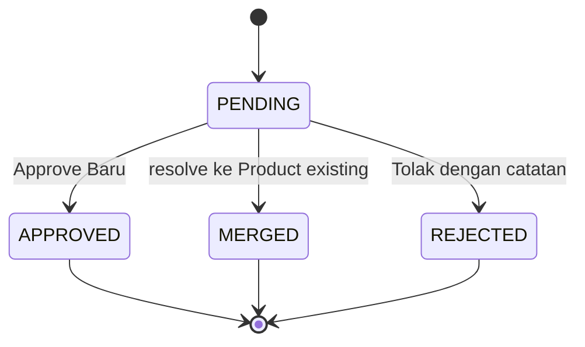

# Flow Admin dan QC

## Status Dokumen

- Baseline source: `45e90d205a8485469583342f0d69e73f58410d24`
- Target pembaca: Developer Aloptama Collect
- Source of truth: source code, tests, dan migrations pada baseline di atas

## Gambaran Umum Super Admin

Super Admin mengelola pandangan lintas Station. UI Admin tidak menggantikan otorisasi: page/API memerlukan session, sedangkan RPC Admin melakukan `require_super_admin()` sebelum membaca atau memutasi data sensitif.

`/admin?view=...` adalah source of truth navigasi top-level. Refresh, browser history, dan link baru tetap membuka view yang benar.

## Peta Area Admin

| Area | Tanggung jawab |
| --- | --- |
| Ringkasan | angka dasar, monitoring Completion, Site berdasarkan Tipe Site, Gudang informational progress, ringkasan QC |
| Stasiun & Pengisian | master scoped Station dan monitoring/detail/archive Submission |
| Produk | Product canonical, status, dependency, reference, move, merge, delete guarded |
| QC Produk | review Product Proposal PENDING/hasil QC |
| Akun Stasiun | provision, reset password, aktivasi account Station |
| Lock Aktif | observasi soft lock Submission |
| Audit Admin | jejak tindakan Admin |
| Panduan | panduan in-app untuk peran Admin |

## Admin Ringkasan

`AdminDashboard.tsx` menyusun Ringkasan dari dataset yang terpisah. Basic counts, Completion monitoring, summary Tipe Site, QC status, dan data UI lain tidak boleh diasumsikan berasal dari satu query besar.

- `admin_completion_monitoring_summary()` mengembalikan Station dan Site Type completion dalam satu response set-based.
- `admin_site_type_completion_summary()` adalah endpoint ringkas khusus Site Type, termasuk Gudang informational coverage.
- `admin_product_proposal_status_summary()` memberi count QC database-wide.
- daftar Product Proposal memakai RPC paginated sendiri.

Loading/error dataset Completion dan QC diisolasi agar kegagalan salah satunya tidak harus menjatuhkan seluruh shell Admin.

## Monitoring Pengisian

Monitoring menggunakan status Station hasil agregasi pair Site/Subtipe non-Gudang:

| Status Station | Kondisi agregat |
| --- | --- |
| `PERLU_PERHATIAN` | ada issue structural/data atau Submission unexpected |
| `TIDAK_DINILAI` | tidak ada expected non-Gudang pair |
| `BELUM_DIMULAI` | expected pair ada tetapi tidak ada Submission current |
| `LENGKAP` | semua expected pair current ada dan seluruhnya lengkap |
| `TERISI_SEBAGIAN` | kondisi lain yang valid namun belum lengkap |

Detail pair dapat memiliki status `KOSONG`, `TERISI_SEBAGIAN`, `LENGKAP`, `BELUM_DIMULAI`, `PERLU_PERHATIAN`, atau `GUDANG_TERSEDIA`. `PERLU_PERHATIAN` bukan band persentase; ia adalah sinyal issue yang harus diperiksa pada detail/issue code.

Global Progress Pengisian dihitung dari `sum(filled_category_count) / sum(expected_category_count)` untuk context expected non-Gudang. Ini bukan rata-rata persentase Station.

## Site berdasarkan Tipe Site

Summary Tipe Site memakai relasi master active `sites.site_type_id -> site_types.id`, lalu menghitung Site unik. AWOS atau Site lain tidak dipecah menurut jumlah Subtipe. Untuk Tipe Site non-Gudang, percent adalah kategori filled dibagi kategori expected. Jangan infer Tipe Site dari nama Site atau Subtipe.

## Gudang pada Ringkasan

Gudang tidak masuk category completion. Card/row Gudang adalah informational Submission coverage:

```text
distinct Station dengan minimal satu Submission Gudang active/current
/
distinct Station yang memiliki Site Gudang active
* 100
```

Perhitungan tidak membaca jumlah item, kategori payload, quantity, atau tingkat kelengkapan inventaris. "Sudah isi Gudang" berarti ada Submission Gudang current, bukan Gudang dinilai lengkap.

## QC Produk

QC memproses `product_proposals` dari Station flow. Proposal raw, Station/Submission association, reviewer data, dan hasil QC tetap disimpan sebagai history. QC tidak menulis ulang payload Submission global hanya karena proposal telah resolved.



## Product Proposal Lifecycle

| Status | Meaning current | `resolved_product_id` |
| --- | --- | --- |
| `PENDING` | workload QC belum diputuskan | null |
| `APPROVED` | QC membuat Product canonical baru | Product baru |
| `MERGED` | QC menghubungkan proposal ke Product canonical existing | Product target |
| `REJECTED` | proposal ditolak; review note wajib | null |

Proposal PENDING tetap workload QC walaupun context UI menyatakan tidak digunakan saat ini. Context tersebut membantu prioritas review, bukan filter untuk menghilangkan PENDING dari count authoritative.

## Daftar Proposal dan Pagination

Design QC sengaja memisahkan:

```text
badge/count status -> admin_product_proposal_status_summary()
row proposal/filter/search/page -> admin_list_product_proposals(...)
```

Filter dijalankan sebelum pagination dan payload Submission tidak dikirim ke browser untuk list QC. Ini aman untuk lebih dari 1000 row.

### Mengapa count tidak boleh dari list

PostgREST list dapat dibatasi 1000 row. Menghitung `.filter().length` di client dari list yang sudah dibatasi pernah membuat badge status salah. Jangan membangun ulang badge dari page yang sedang dimuat; gunakan aggregate RPC database-wide.

## Approve Baru

`admin_approve_product_proposal_v2` mengunci/memvalidasi proposal PENDING, membuat Product canonical, membuat alias yang relevan, lalu mengisi status review, reviewer, waktu review, note, dan `resolved_product_id`. UUID Product Proposal asli serta `submission_id`/`station_id` tetap menjadi history.

Payload item yang menyimpan `productProposalId` tidak perlu berubah menjadi `productId`; resolver membaca `resolved_product_id` untuk menampilkan canonical result.

## Resolve ke Product Existing

Flow QC bernama Merge memilih satu atau beberapa proposal PENDING dan target `products.id` existing melalui `admin_merge_product_proposals_v2`. Ia mengubah proposal menjadi `MERGED`, mengisi `resolved_product_id`, menyimpan reviewer/note, dan membuat alias sesuai kontrak QC.

Istilah ini berbeda dari **Produk -> Gabungkan Produk**. QC Merge menyelesaikan proposal ke katalog existing; Product Merge menggabungkan dua Product canonical beserta dependency mereka.

## Reject

`admin_reject_product_proposal_v2` hanya berlaku pada PENDING. Ia menulis `REJECTED`, reviewer/waktu review, dan review note wajib. Tidak ada Product canonical baru, alias baru, atau `resolved_product_id` hasil Reject. Item Submission tetap memegang historical `productProposalId`.

## Audit dan Reviewer Metadata

Proposal menyimpan state/reviewer/time/note. Operation Admin yang relevan juga menulis `admin_audit_log`, sehingga investigasi dapat menggabungkan history proposal dan audit action. Ini bukan event sourcing lengkap; gunakan record yang tersedia, bukan asumsi bahwa setiap perubahan field memiliki event granular tersendiri.

## Authorization Boundary

QC mutation hanya untuk Super Admin. Browser/API mungkin membantu validasi input, tetapi RPC `_v2` memanggil authorization database dan menangani conflict concurrent reviewer. Detail identity/session dijelaskan di [Authentication dan Otorisasi](./06-AUTH-DAN-OTORISASI.md).

## Error / Conflict Handling

QC action dapat gagal bila proposal tidak lagi PENDING, target Product berubah/tidak valid, atau reviewer lain sudah menyelesaikan row. UI harus refresh data authoritative dan tidak menerapkan hasil optimistis lokal sebagai fakta final.

## Historical Incident Guardrails

- Jangan menghitung QC count dari client list terpaginated; gunakan aggregate status RPC.
- Jangan menganggap `resolved_product_id` tidak penting pada Product merge. Migration `20260831120000_product_merge_qc_references.sql` dan `tests/product-merge.test.mjs` memastikan resolved QC reference ikut direpoint secara atomik.
- Jangan menghapus PENDING proposal yang masih direferensikan payload. Cleanup save-time hanya menghapus PENDING orphan; history resolved/rejected dipertahankan.

## Execution Path Utama

| Step | Frontend/API | RPC/database | Mutation |
| --- | --- | --- | --- |
| load badge | `AdminDashboard` | status summary RPC | no |
| load list | `/api/admin/product-proposals` | paginated list RPC | no |
| select action | QC dialog | validates current row | no |
| Approve Baru | dialog | approve `_v2` | Product, alias, proposal, audit |
| QC Merge | dialog | merge proposals `_v2` | proposal resolution, alias, audit |
| Reject | dialog | reject `_v2` | proposal review fields, audit |
| refresh | dashboard cache | summary/list RPC | no |

## Relevant Source Files

- `app/admin/AdminDashboard.tsx` - Admin shell, isolated summary/QC loading, navigation.
- `app/admin/ApproveProductDialog.tsx`, `app/admin/MergeTargetDialog.tsx` - QC action UI.
- `app/lib/qc-proposal-context.ts`, `app/lib/product-qc.ts` - context/resolution presentation.
- `app/api/admin/product-proposals/route.ts` - paginated QC API.

## Relevant API / RPC

- `admin_completion_monitoring_summary`, `admin_site_type_completion_summary`.
- `admin_product_proposal_status_summary`, `admin_list_product_proposals`.
- `admin_approve_product_proposal_v2`, `admin_merge_product_proposals_v2`, `admin_reject_product_proposal_v2`.

## Relevant Tests

- `tests/admin-qc.test.mjs`, `tests/qc-pending-summary.test.mjs` - QC state/list/count contract.
- `tests/product-merge.test.mjs` - resolved QC result behavior during Product merge.
- `tests/station-monitoring.test.mjs`, `tests/station-completion-engine.test.mjs`, `tests/warehouse.test.mjs` - dashboard/completion/Gudang semantics.

## Invariants

- PENDING count berasal dari aggregate database, bukan page list.
- Proposal history tidak hilang setelah APPROVED, MERGED, atau REJECTED.
- QC resolution tidak sama dengan Product Merge.
- Pending QC tidak mengurangi Completion pengisian.
- Semua QC mutation memerlukan Super Admin authorization.

## Hal yang Tidak Boleh Dilakukan

- Jangan mengubah status proposal langsung dari UI/table update.
- Jangan menghapus PENDING hanya karena context tidak digunakan saat ini.
- Jangan menulis ulang Submission payload global saat QC resolve.
- Jangan bypass reviewer conflict handling.

## Source of Truth untuk Dokumen Ini

- `app/admin/AdminDashboard.tsx`, `app/api/admin/product-proposals/route.ts`.
- `supabase/migrations/20260818120000_multi_super_admin_qc.sql` - final QC `_v2` action semantics.
- `supabase/migrations/20260902120000_admin_product_proposal_status_summary.sql`, `20260902130000_admin_list_product_proposals.sql` - aggregate and pagination.
- `supabase/migrations/20260903120000_optimize_station_completion.sql`, `20260905120000_gudang_submission_progress.sql` - current monitoring/Gudang summary.
- `tests/admin-qc.test.mjs`, `tests/qc-pending-summary.test.mjs`, `tests/product-merge.test.mjs`.

## Baca Sebelumnya

[Flow Station dan Submission](./07-FLOW-STATION-DAN-SUBMISSION.md)

## Baca Selanjutnya

[Product Master dan Referensi](./09-PRODUCT-MASTER-DAN-REFERENSI.md)
