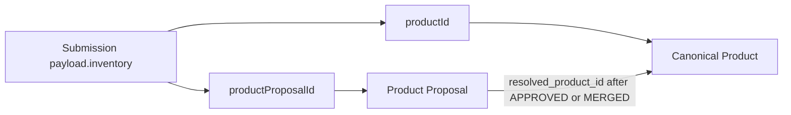

# Product Master dan Referensi

## Status Dokumen

- Baseline source: `45e90d205a8485469583342f0d69e73f58410d24`
- Target pembaca: Developer Aloptama Collect
- Source of truth: source code, tests, dan migrations pada baseline di atas

## Konsep Product Canonical

`products.id` adalah identity canonical Product. Display memakai `brand` dan `model`, tetapi identity dan operation aman selalu memakai UUID. Kolom lifecycle penting mencakup `active`, `source_origin`, timestamps, dan `merged_into_product_id` untuk Product yang telah digabungkan.

Product inactive tidak ditawarkan untuk pilihan baru, tetapi history/references tetap dapat dibaca. Product merged tidak hard-deleted: source dibuat inactive dan menunjuk target canonical melalui `merged_into_product_id`.

## Product Alias

`product_aliases` memetakan variasi Brand/Model ke satu `products.id` canonical. Alias membantu lookup/search dan menjaga penulisan historis tetap resolvable.

Alias bukan Product Proposal dan bukan direct reference Submission. Alias tidak membuat row inventory baru. Product Merge memindahkan/deduplicate alias ke target; Pindahkan Referensi tidak mengubah `products` maupun `product_aliases`.

## Product Proposal

`product_proposals` menyimpan usulan raw dari Station. Setelah QC:

- APPROVED/MERGED menyimpan `resolved_product_id` ke Product canonical.
- REJECTED tidak memiliki Product result.
- proposal dan `submission_id` asal tetap menjadi history.

Product yang dibuat dengan Approve Baru dapat memiliki banyak proposal history yang `resolved_product_id`-nya menunjuk Product tersebut.

Karena satu Product canonical dapat menyelesaikan banyak proposal, keberadaan QC_RESULT sebelumnya tidak mengecualikan Product dari target QC Merge. Dialog QC mencari Product aktif/current berdasarkan UUID melalui search server-side terpaginated, bukan dengan memfilter satu halaman katalog di browser.

Approve Baru menggunakan identity normalized Brand/Model yang sama dengan pengelolaan Product. Jika canonical Product sudah ada, proposal tidak diubah dan Admin harus menyelesaikannya melalui QC Merge. QC Merge menerima Product UUID pilihan, tetapi menyimpan `resolved_product_id` canonical terbaru bila target pilihan sudah digabungkan sebelumnya.

## Product Provenance

`source_origin` memberi provenance, misalnya master legacy, QC, atau Admin sesuai value yang divalidasi current schema/RPC. `spreadsheet_synced` adalah metadata legacy/provenance; ia bukan instruksi untuk menyinkronkan runtime master ke Spreadsheet dan bukan indikator kualitas canonical.

## Bagaimana Product Direferensikan

Relasi `productId` dan `productProposalId` berada di JSON payload; bukan FK conventional dari `submissions` ke Product. Resolver harus membedakan keduanya.

Merk/Tipe yang terlihat untuk reference resolved berasal dari Product canonical current. DIRECT di-resolve melalui `productId`; QC_RESULT di-resolve melalui `product_proposals.resolved_product_id`. Snapshot DIRECT serta Brand/Tipe usulan proposal tetap disimpan untuk provenance dan fallback, tetapi tidak mengalahkan canonical Product yang tersedia. PENDING yang belum mempunyai canonical result tetap menampilkan usulan asli.

Aturan ini berlaku pada form Station/Admin-as-user, detail Submission Admin, dan
export inventaris current. Resolver melakukan lookup bulk hanya untuk UUID yang
direferensikan. Alias membantu pencarian tetapi tidak menjadi identity tampilan;
QC History dan label Usulan tetap menyajikan nilai historis.

## Direct Reference

**DIRECT** adalah satu occurrence exact `productId` pada item `submissions.payload.inventory` current. Identity selective move adalah kombinasi Submission UUID, expected Submission version, dan `itemId`. Reference direct tidak selectable bila Submission archived atau memiliki active lock.

## QC Result Reference

**QC_RESULT** adalah `product_proposals` APPROVED/MERGED dengan `resolved_product_id` yang menunjuk Product target. Proposal tersebut terhubung ke Submission current melalui `submission_id`; payload occurrence asal tetap memakai `productProposalId`.

Identity selective QC move memakai proposal UUID dan `expectedProposalUpdatedAt`. Proposal yang status/resolution/timestamp-nya berubah setelah UI load ditolak sebagai `reference_changed`.

## Dependency dan Referensi

Dialog Penggunaan Produk membedakan dua pandangan:

- **Dependency**: ringkasan hubungan yang memblokir/menjelaskan operation Product, termasuk reference canonical dan hubungan QC/alias yang relevan.
- **Referensi**: baris occurrence yang dapat ditelusuri dan, bila valid, dipilih untuk Pindahkan Referensi.

`admin_product_dependencies` dan `admin_product_references` adalah RPC berbeda. Referensi menggunakan pagination server-side, search sebelum pagination, dan tidak mengirim payload Submission penuh ke browser.

## Category Context

Context referensi DIRECT berasal dari occurrence JSON exact: Station, Site, Tipe Site, Subtipe, kategori storage, dan `functionCategories` bila tersedia. Context tidak ditebak dari nama Product.

QC_RESULT menampilkan konteks Submission/proposal dan category result `Hasil QC`; proposal context QC terpisah dapat menemukan semua category payload yang memakai `productProposalId`. Multi-category dideduplikasi oleh source context sebelum UI menampilkan ringkasannya.

Kolom **Kategori** pada daftar Admin Produk merangkum category display unik dari
referensi current yang sama: occurrence DIRECT serta proposal APPROVED/MERGED
yang masih direferensikan oleh Submission aktif. Nilai kosong tidak ditampilkan,
duplikat exact ditampilkan sekali, dan hasil diurutkan alfabetis secara stabil.
Kolom ini bukan master kategori pada Product dan tidak diturunkan dari Merk/Tipe.

Filter referensi pada daftar Admin Produk memakai source occurrence yang sama.
Kategori menggunakan label canonical tersebut dan dapat dipilih lebih dari satu
(OR). Kelompok Stasiun memakai `stations.station_category_id`, sedangkan Tipe
Site memakai `sites.site_type_id`; ketiganya digabungkan dengan AND pada satu
occurrence. Filtering berlangsung sebelum sorting dan pagination, sementara
kolom Kategori tetap menampilkan seluruh kategori Product pada halaman aktif.

## Pindahkan Referensi

Pindahkan Referensi memindahkan **baris yang dipilih saja** dari Product source ke Product target active. Selection dapat berisi DIRECT, QC_RESULT, atau campuran sampai limit API yang tervalidasi.

| Reference type | Mutation |
| --- | --- |
| DIRECT | item JSON `productId`, `brand`, `model` berubah ke target; Submission `version` naik satu per Submission yang disentuh |
| QC_RESULT | `product_proposals.resolved_product_id` berubah ke target; payload Submission tidak direwrite |

Operation mengambil lock row proposal/Submission, menjalankan validation ulang setelah lock, dan seluruh mutation berada dalam satu transaction RPC. Bila precondition gagal, return status conflict tanpa partial mutation.

## Hapus Referensi

Hapus Referensi melepas **occurrence yang dipilih saja** dari Product canonical
tanpa menghapus Product, Submission, kategori, alias, atau riwayat QC. Identity
occurrence memakai `submissionId`, expected version, storage category, ordinal
item, dan item ID bila tersedia; QC_RESULT juga membawa proposal ID dan snapshot
`updated_at` proposal.

| Reference type | Mutation |
| --- | --- |
| DIRECT | key `productId` dilepas dari item exact; Brand/Model snapshot dan metadata item tetap |
| QC_RESULT | key `productProposalId` dilepas dari item exact; proposal APPROVED/MERGED dan review history tetap |

RPC mengunci proposal dan Submission terkait dengan urutan deterministik, lalu
memvalidasi ulang seluruh selection. Setiap Submission yang berubah naik satu
version. Jika satu occurrence stale, archived, berubah Product, atau memiliki
lock aktif, seluruh batch rollback. Request kedua dengan snapshot lama ditolak
oleh version guard dan tidak membuat audit sukses ganda.

## Gabungkan Produk

Product Merge memindahkan **semua dependency supported** dari Product source ke target setelah preflight token current. Ia menangani direct reference current, QC_RESULT resolved proposal, aliases, audit, lalu membuat source inactive dan mengisi `merged_into_product_id` target.

Merge tidak sama dengan destructive delete. Source UUID/history tetap ada untuk traceability, tetapi status UI menjadi Digabungkan dan Product tidak lagi active untuk selection baru.

## Perbedaan Operasi Product

| Behavior | Edit Product | Pindahkan Referensi | Hapus Referensi | Gabungkan Produk | Hapus Product |
| --- | --- | --- | --- | --- | --- |
| Scope | satu canonical Product | selected reference rows | selected exact occurrences | semua dependency source yang didukung | Product master yang lolos guard |
| Reference | tetap terhubung dan current display mengikuti nama baru | source ke Product target | linkage dilepas, item tetap | seluruh dependency supported ke target | tidak berlaku bila dependency masih ada |
| Submission version | tidak berubah | naik untuk payload DIRECT yang diubah | naik sekali per Submission yang diubah | naik untuk payload direct yang diubah | tidak mengubah Submission |
| Alias/QC history | sesuai rename alias existing | tidak berubah | tidak berubah | dikonsolidasikan sesuai kontrak merge | harus lolos dependency preflight |
| Product source | UUID sama | tetap | tetap | inactive dan menunjuk target | row dihapus hanya bila aman |
| Audit | `PRODUCT_UPDATE` | `PRODUCT_REFERENCE_MOVE` | `PRODUCT_REFERENCE_REMOVE` | `PRODUCT_MERGE` | `PRODUCT_DELETE` |

Gunakan Pindahkan Referensi untuk koreksi subset. Gunakan Gabungkan Produk hanya ketika dua canonical Product memang harus menjadi satu identity operational.

## Stale QC Guard dan Atomicity

Preflight menangkap snapshot identity. Saat apply, RPC mengunci row terkait dan memvalidasi ulang:

- DIRECT: Submission ada, current, unlocked, expected version sama, item muncul tepat satu kali, dan masih menunjuk source Product.
- QC_RESULT: proposal masih APPROVED/MERGED, masih menunjuk source Product, Submission current, serta `updated_at` sama pada precision milidetik dengan snapshot.

Failure seperti `version_conflict`, `active_lock`, `reference_changed`, atau `source_mismatch` menghentikan operation. Transaction menjamin mutation complex berhasil bersama atau rollback; jangan menambah client-side loop yang memindahkan sebagian row sendiri.

## Submission Version Semantics

Direct Product reference mutation mengubah JSON payload sehingga menaikkan `submissions.version`. QC_RESULT move hanya mengubah `resolved_product_id` proposal sehingga tidak menaikkan version Submission. Product Merge mengikuti aturan yang sama: direct payload current yang berubah menaikkan version; repoint QC result tidak membutuhkan rewrite payload.

Ini melengkapi [Flow Station dan Submission](./07-FLOW-STATION-DAN-SUBMISSION.md): expected version tetap wajib untuk semua mutation payload direct.

## Audit Trail

Reference move mencatat `PRODUCT_REFERENCE_MOVE`. Reference removal mencatat `PRODUCT_REFERENCE_REMOVE` per Submission yang berubah dan satu record Product-level tanpa menyimpan seluruh payload. Merge mencatat `PRODUCT_MERGE` beserta snapshot/preflight semantics. QC resolution memiliki reviewer/timestamp/note pada proposal dan audit Admin. Audit membantu traceability, bukan izin untuk melewati preflight.

## Legacy / Historical Guardrails

Migration `20260831120000_product_merge_qc_references.sql` memperbaiki merge agar resolved QC proposal ikut direpoint secara atomik. Tanpa langkah ini, Product source dapat terlihat tidak lagi dipakai pada direct payload tetapi masih direferensikan `resolved_product_id`.

Guardrail current:

- Jangan memindahkan alias saat selective reference move.
- Jangan menghapus source Product setelah merge.
- Jangan mengabaikan QC_RESULT hanya karena tidak memiliki `productId` payload.
- Jangan count dependency dari satu page client.

## Execution Paths

| Operation | API | RPC | Primary mutation |
| --- | --- | --- | --- |
| list/dependency | `/api/admin/products`, `/dependencies` | list/dependencies | no |
| reference view | `/references` | `admin_product_reference_occurrences` | no |
| move preflight | `/move-preflight` | `admin_product_reference_move_preflight` | no |
| move apply | `/move` | `admin_move_product_references` | selected JSON/reference result |
| remove preflight | `/remove-preflight` | `admin_product_reference_removal_preflight` | no |
| remove apply | `/remove` | `admin_remove_product_references` | selected occurrence linkage |
| merge preflight | `/merge-preflight` | `admin_product_merge_preflight` | no |
| merge apply | `/merge` | `admin_merge_product` | all supported dependencies + source state |
| delete preflight/apply | `/delete-preflight`, `DELETE /[id]` | delete RPC | only eligible inactive orphan Product |

## Admin Product List Reliability

Pada sort biasa, daftar Product menampilkan baris master dan canonical merge
lebih dahulu. Satu request page-level kemudian mengisi jumlah penggunaan dan
kategori melalui `admin_product_page_enrichment`; RPC ini mengekstrak occurrence
Submission satu kali dan mempertahankan agregasi usage serta category yang
berbeda. Filter metadata yang relatif mahal baru dimuat setelah enrichment awal
selesai dan digunakan kembali selama sesi UI. Full-population enrichment hanya
diperlukan saat sorting **Penggunaan**, karena urutan tidak boleh dihitung dari
sebagian Product.

Kegagalan enrichment pada sort biasa tidak boleh mengubah Product menjadi
kosong atau jumlah referensi menjadi nol. API mengembalikan baris yang sudah
tersedia beserta issue terpisah; UI menampilkan **Gagal dimuat** pada field yang
tidak authoritative dan mempertahankan data terakhir. Ringkasan Product dimuat
terpisah dan tidak diulang pada setiap pagination, search, atau filter.
Ketika URL langsung membuka menu Produk, shell Admin tidak memulai preload
seluruh data Stasiun, Submission, Akun, dan Audit. Data shell tersebut baru
dimuat saat view lain membutuhkannya.

## Relevant Source / RPC / Migration

- `app/admin/AdminProducts.tsx`, `ProductReferenceMoveDialog.tsx`, `ProductReferenceRemoveDialog.tsx`, `ProductMergeDialog.tsx`.
- `app/lib/admin-product-api.ts`, `app/lib/product-reference-selection.ts`, `app/lib/admin-product-list.ts`.
- `app/api/admin/products/[id]/dependencies`, `references`, `move-preflight`, `move`, `remove-preflight`, `remove`, `merge-preflight`, `merge`.
- `20260821120000_product_reference_preflight.sql` through `20260911130000_product_reference_removal.sql`.

## Relevant Tests

- `tests/product-dependencies.test.mjs` - dependency visibility.
- `tests/product-reference-removal.test.mjs` dan `verify:product-reference-removal` - exact unlink, atomicity, stale guard, projection, dan QC history preservation.
- `tests/product-reference-context.test.mjs`, `tests/product-reference-move.test.mjs`, `tests/product-reference-selection.test.mjs` - exact reference/move contract.
- `tests/product-merge.test.mjs`, `tests/product-delete.test.mjs` - merge/delete safety.
- `tests/admin-products.test.mjs` - Product Admin list/create/edit/status behavior.

## Invariants

- Canonical identity is `products.id`, not display text.
- DIRECT and QC_RESULT are different reference types.
- Selective move never changes aliases or Product source state.
- Merge repoints aliases and QC results, then retires source Product without hard delete.
- JSON payload mutation must carry expected Submission version.
- Product reference operations require Super Admin and preflight/revalidation.

## Hal yang Tidak Boleh Dilakukan

- Jangan update `resolved_product_id` dari client/table direct.
- Jangan global-rewrite payload untuk QC_RESULT movement.
- Jangan use Product Merge untuk sekadar satu reference correction.

## Architecture Decision Records

[ADR-004 Product Reference Model](./adr/ADR-004-PRODUCT-REFERENCE-MODEL.md) dan [ADR-005 QC History Preservation](./adr/ADR-005-QC-HISTORY-PRESERVATION.md) menjelaskan rationale permanen untuk dual reference dan preservation history.
- Jangan resolve source/target Product berdasarkan Brand/Model string.
- Jangan remove stale guard, active-lock guard, atau preflight token.

## Source of Truth untuk Dokumen Ini

- `app/lib/admin-product-api.ts`, `app/lib/product-reference-selection.ts`, `app/lib/admin-product-list.ts`.
- `app/api/admin/products/[id]/references/route.ts`, move/merge/dependency routes.
- `supabase/migrations/20260823120000_product_reference_move.sql`, `20260824120000_product_merge.sql`, `20260831120000_product_merge_qc_references.sql`, `20260901120000_product_reference_move_qc_results.sql`, `20260904120000_product_reference_category_context.sql`.
- `tests/product-reference-move.test.mjs`, `tests/product-reference-context.test.mjs`, `tests/product-merge.test.mjs`, `tests/product-delete.test.mjs`.

## Baca Sebelumnya

[Flow Admin dan QC](./08-FLOW-ADMIN-DAN-QC.md)

## Baca Selanjutnya

[Completion dan Monitoring](./10-COMPLETION-DAN-MONITORING.md)
