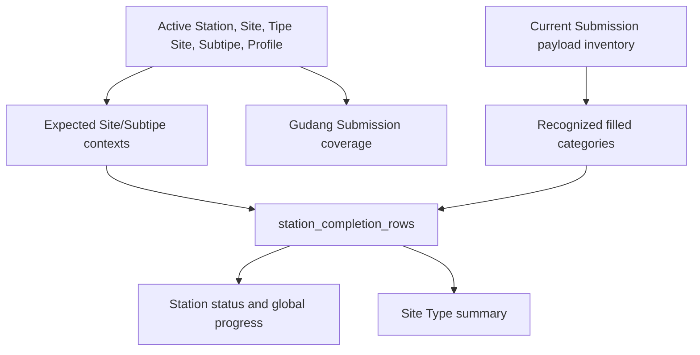

# Completion dan Monitoring

## Status Dokumen

- Baseline source: `45e90d205a8485469583342f0d69e73f58410d24`
- Target pembaca: Developer Aloptama Collect
- Source of truth: source code, tests, dan migrations pada baseline di atas

## Tujuan Completion Engine

Completion menjawab apakah context pengisian Site/Subtipe current sudah terisi terhadap konfigurasi master current. Engine ini tidak menghitung kualitas QC Product, metadata Site, atau kelengkapan Gudang. SQL authoritative berada pada `station_completion_rows()` dan summary Admin set-based yang memakainya.



## Unit Perhitungan

Satu **expected non-Gudang Site/Subtipe pair** adalah satu unit Pengisian. Expected context berasal dari master current: Station active, Site active, Tipe Site active, Subtipe active, Item Profile, serta assignment Site/Subtipe apabila Tipe Site mewajibkannya.

Satu Site AWOS dengan beberapa Subtipe expected menghasilkan beberapa pair Pengisian, tetapi summary Site Type tetap menghitung Site parent satu kali untuk `site_count`.

## Expected dan Filled

| Concept | Semantics current |
| --- | --- |
| Expected category | active `profile_items` dari Item Profile Subtipe current |
| Filled category | minimal satu inventory fact recognized pada category canonical expected |
| Missing expected category | tetap di denominator, tidak filled |
| Unexpected Submission | Submission active untuk context yang bukan expected; memberi attention signal |

Recognized inventory fact berasal dari parser database payload, bukan hanya ada object kategori kosong. Fact dapat berasal dari Product Brand/Model valid atau material bernama, sesuai `submission_inventory_facts()` current semantics. Jangan mengubah definisi ini hanya dari UI appearance; test completion adalah kontrak utama.

## Metadata, Unit Fields, dan Product QC

- `siteMetadata` tidak ikut numerator/denominator Completion.
- serial number, condition, installed year, notes, dan unit details tidak menentukan kategori filled.
- Product Proposal PENDING tidak mengurangi Completion. Completion mengukur pengisian data, bukan keputusan QC.
- QC resolution juga tidak mengubah Completion hanya karena proposal berubah APPROVED/MERGED; payload/fact tetap dibaca dengan semantics yang sama.

## Gudang

Gudang dikecualikan dari category completeness. Untuk row Gudang, category expected/filled tidak dipakai sebagai percent Completion; summary memisahkan `warehouse_category_count` dan `warehouse_unit_count` untuk informasi, bukan scoring.

### Gudang Submission Progress

Progress Gudang yang ditampilkan Admin adalah:

```text
distinct Station dengan Submission Gudang active/current
/
distinct Station dengan Site Gudang active
* 100
```

Ia tidak memeriksa item count, category count, quantity, atau payload fullness. Jangan menyebut hasil tersebut sebagai kelengkapan inventaris Gudang.

## Status Definitions

### Status per expected Site/Subtipe row

| Status | Exact condition ringkas | Meaning |
| --- | --- | --- |
| `PERLU_PERHATIAN` | issue code context atau lebih dari satu active Submission | data/master anomaly perlu diperiksa |
| `BELUM_DIMULAI` | tidak ada Submission active | pair belum memiliki Submission current |
| `GUDANG_TERSEDIA` | context Gudang expected | tersedia untuk informational flow, bukan score completion |
| `KOSONG` | Submission ada, expected category positive, filled zero | mulai dibuat tetapi belum ada fact recognized |
| `TERISI_SEBAGIAN` | filled di antara zero dan expected | sebagian kategori expected terisi |
| `LENGKAP` | filled sama dengan expected | seluruh kategori expected terisi |

`PERLU_PERHATIAN` juga muncul jika expected category count tidak valid/zero pada context yang seharusnya dinilai. Jangan map status ini ke persentase tertentu.

### Status Station

| Status | Exact condition ringkas |
| --- | --- |
| `PERLU_PERHATIAN` | ada expected attention, unexpected Submission, atau Station tanpa Site active |
| `TIDAK_DINILAI` | tidak ada expected non-Gudang pair dan tidak ada attention |
| `BELUM_DIMULAI` | expected pair ada, tidak ada Submission current, dan tidak ada attention |
| `LENGKAP` | semua expected pair current ada serta `LENGKAP` |
| `TERISI_SEBAGIAN` | Station valid lain yang belum memenuhi lengkap |

## Global Progress Pengisian

Global progress dijumlah berbobot dari semua expected non-Gudang category:

```text
SUM(filled_category_count)
/
SUM(expected_category_count)
* 100
```

Jika expected total nol, progress bernilai null/tidak dinilai. Jangan mengganti formula ini menjadi rata-rata percentage Station atau rata-rata Site Type, karena denominator tiap Station berbeda.

## Monitoring Pengisian dan Site Type

`admin_completion_monitoring_summary()` mengembalikan Station summary dan Site Type summary dalam satu call. Station detail dimuat lazy saat operator membuka Station, melalui `admin_station_completion_detail(p_station_id)`; jangan preload detail seluruh Station.

Site Type non-Gudang membawa `site_count`, `expected_category_count`, `filled_category_count`, dan `category_progress`. Site Type Gudang membawa `warehouse_station_count`, `warehouse_submitted_station_count`, dan `warehouse_progress_percent` sebagai informational coverage; `category_progress` adalah null.

## Completion RPC Architecture

| RPC | Scope | Consumer | Role |
| --- | --- | --- | --- |
| `station_completion_rows(p_station_id)` | Station/all | internal summary and Station UI paths | normalized expected/current row engine |
| `admin_completion_monitoring_summary()` | all active Station | Admin Ringkasan | combined Station + Site Type summary |
| `admin_station_completion_detail(p_station_id)` | one Station | lazy Admin expansion | detailed Site/Subtipe/issue view |
| `admin_site_type_completion_summary()` | all active Site Type | Admin summary consumers | compact Site Type/Gudang aggregation |

All are read-only and require appropriate Station or Super Admin authorization according to function scope/grants.

## Performance Architecture

Current summary implementation expands active Submission inventory once into a materialized fact set, aggregates in SQL, and emits combined Station/Site Type result. Detail is lazy to avoid loading every Site/Subtipe row when only summary cards are visible.

Gudang coverage is set-based from current Submission existence and distinct Station; it deliberately does not traverse warehouse item JSON.

### Historical Performance Guardrail

Earlier Admin completion work risked repeated global traversal of Submission JSON across independent summary calculations. Current combined summary and set-based aggregation exist to avoid that shape. Do not restore multiple whole-database completion calls or client-side recomputation merely because a card needs another number.

## Error Isolation

AdminDashboard keeps Completion loading/error state distinct from basic dashboard and QC datasets. A Completion RPC failure can be reported in the monitoring area without treating the entire Admin shell as unavailable. Preserve this isolation when changing data loading.

## Cara Mengubah Business Rule dengan Aman

1. Identify the current RPC and closest semantic test.
2. Define/update expected outcome for expected, filled, status, or Gudang separately.
3. Add a new migration; never edit applied migration.
4. Apply/reset Supabase local and run completion verifier.
5. Run focused engine, detail, master UI, unified filling, and Station monitoring tests.
6. Compare parity/performance unless behavior intentionally changes.
7. Apply production only in an explicit release task, then verify DB -> RPC -> UI.

Do not use a volatile production count as a regression fixture or business invariant.

## Relevant Source / RPC / Migration

- `app/admin/AdminDashboard.tsx`, `app/admin/StationCompletionDetail.tsx`, `app/lib/station-completion.ts`, `app/lib/admin-summary.ts`.
- `supabase/migrations/20260827120000_station_completion_engine.sql` - initial engine.
- `supabase/migrations/20260828120000_exclude_warehouse_from_station_completion.sql` - Gudang exclusion.
- `supabase/migrations/20260830120000_admin_site_type_completion_summary.sql`, `20260830140000_fix_admin_site_type_completion_summary.sql` - Site Type summary evolution.
- `supabase/migrations/20260903120000_optimize_station_completion.sql`, `20260905120000_gudang_submission_progress.sql` - final set-based combined summary and Gudang coverage.

## Relevant Tests

| Test/verifier | Purpose |
| --- | --- |
| `tests/station-completion-engine.test.mjs` | expected/filled/status engine semantics |
| `tests/station-completion-master-ui.test.mjs` | master/current context UI contract |
| `tests/station-completion-detail-ui.test.mjs` | detail status/issue rendering |
| `tests/unified-filling-view.test.mjs` | unified filling data presentation |
| `tests/station-monitoring.test.mjs` | Station summary/monitoring aggregation |
| `tests/warehouse.test.mjs` | Gudang form and summary semantics |
| `scripts/verify-station-completion.mjs` | local database regression verifier |

## Invariants

- Master current configuration defines expected context; Submission JSON cannot remove denominator.
- Metadata and unit detail are not category completeness.
- Pending QC does not reduce Completion.
- Gudang is excluded from category completion.
- Gudang percentage is distinct Station Submission coverage, not inventory fullness.
- Global progress is weighted category total, not average percentage.
- Completion summary must remain set-based and avoid repeated global JSON traversal.

## Hal yang Tidak Boleh Dilakukan

- Jangan count Gudang item/category/quantity untuk card Gudang progress.
- Jangan include Gudang dalam global Completion denominator.
- Jangan classify `PERLU_PERHATIAN` berdasarkan percentage band.
- Jangan eager-load detail semua Station.
- Jangan edit migration applied untuk mengubah formula.
- Jangan bypass semantic tests ketika mengubah payload parser atau master mapping.

## Source of Truth untuk Dokumen Ini

- `app/admin/AdminDashboard.tsx`, `app/lib/station-completion.ts`, `app/lib/admin-summary.ts`.
- `supabase/migrations/20260827120000_station_completion_engine.sql`, `20260828120000_exclude_warehouse_from_station_completion.sql`, `20260903120000_optimize_station_completion.sql`, `20260905120000_gudang_submission_progress.sql`.
- `tests/station-completion-engine.test.mjs`, `tests/station-completion-master-ui.test.mjs`, `tests/station-completion-detail-ui.test.mjs`, `tests/unified-filling-view.test.mjs`, `tests/station-monitoring.test.mjs`, `tests/warehouse.test.mjs`.

## Baca Sebelumnya

[Product Master dan Referensi](./09-PRODUCT-MASTER-DAN-REFERENSI.md)

## Lanjutan Dokumentasi

[Deployment dan Infrastruktur](./11-DEPLOYMENT-DAN-INFRASTRUKTUR.md)
