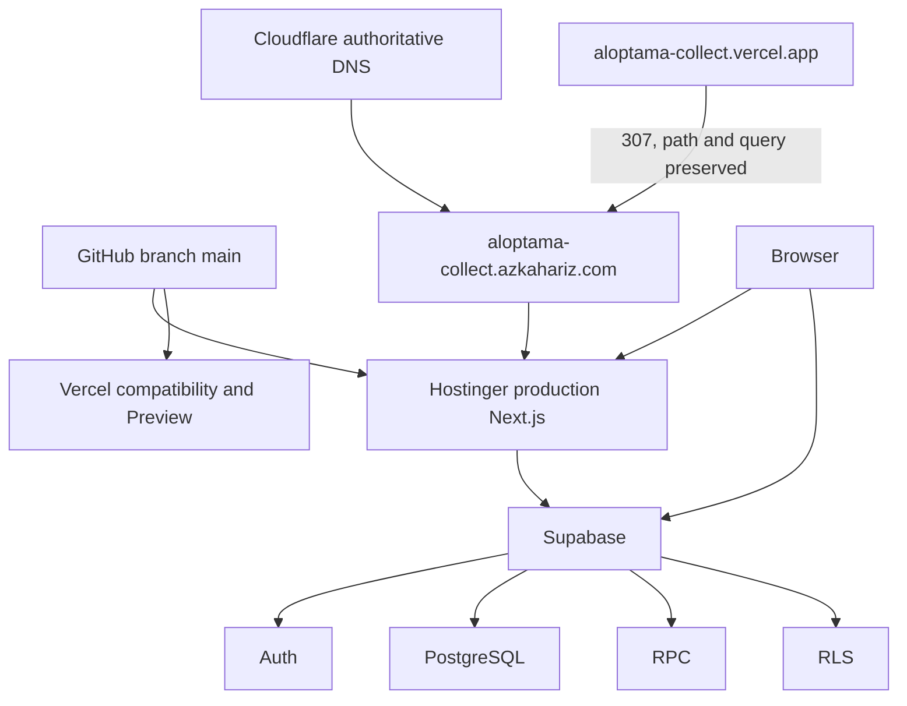

# Deployment dan Infrastruktur

## Status Dokumen

- Baseline source: `f5b4c1a7248b3da680fff7b19750fcfd00ec40a4`
- Target pembaca: Developer/Operator Aloptama Collect
- Source of truth: source code, configuration, tests, migrations, dan fakta operator yang secara eksplisit ditandai

## Ringkasan Production Topology

Runtime aplikasi canonical adalah Next.js pada Hostinger. Supabase menyediakan Auth, PostgreSQL, RPC, dan RLS. Cloudflare berperan sebagai DNS authoritative untuk hostname canonical. Vercel dipakai untuk Preview dan mempertahankan hostname legacy yang mengarahkan pengguna ke hostname canonical.

## Diagram Infrastruktur



## Domain Canonical

`https://aloptama-collect.azkahariz.com` adalah origin canonical yang ditetapkan source aplikasi. Jangan mengganti hostname ini hanya dari konfigurasi browser atau catatan lama; periksa `app/lib/legacy-vercel-redirect.ts` dan deployment operator terlebih dahulu.

## Hostinger Runtime

[TERBUKTI DARI REPOSITORY] Aplikasi adalah Next.js dan membutuhkan Node `>=22.13.0`. Perintah runtime yang tersedia adalah `npm run build` dan `npm run start`.

Operator input: [OP-002 dan OP-011](./OPERATOR-INPUT-WORKSHEET.md) mencatat ownership/access Hostinger serta project, log, dan auto-deploy. Repository tidak menyimpan konfigurasi dashboard tersebut.

## Supabase

Supabase adalah batas backend operasional: Auth untuk sesi, PostgreSQL untuk data, RPC untuk operasi domain, dan RLS/authorization untuk pembatasan akses. Migration berada di `supabase/migrations/`, tetapi status production harus diverifikasi melalui Supabase CLI atau dashboard saat operasi.

Operator input: [OP-003](./OPERATOR-INPUT-WORKSHEET.md) mencatat ownership, project reference, maintainer, dan recovery Supabase. Jangan menaruh password, secret key, atau connection string lengkap di Markdown.

## Cloudflare DNS

Operator input: [OP-004](./OPERATOR-INPUT-WORKSHEET.md) mencatat ownership/access Cloudflare. Cloudflare dipakai sebagai authoritative DNS berdasarkan fakta operasional yang terdokumentasi, sedangkan repository hanya membuktikan hostname canonical. Jangan menyimpulkan Cloudflare meng-host Next.js. Sebelum perubahan DNS, verifikasi target custom domain dari Hostinger.

Catat owner akun, owner zone, pihak yang boleh mengubah DNS, dan mode record/proxy yang berlaku. Jangan hard-code IP yang mudah berubah.

## Vercel Compatibility dan Preview

### Hostname compatibility production

[TERBUKTI DARI REPOSITORY] Hanya hostname `aloptama-collect.vercel.app` yang menerima redirect HTTP 307 ke hostname canonical. `proxy.ts` menjalankan redirect sebelum refresh session. Path dan query dipertahankan.

### Preview

[TERBUKTI DARI REPOSITORY] Host Vercel lain tidak dialihkan hanya karena memakai domain `vercel.app`; test redirect melindungi Preview agar tetap dapat dipakai untuk validasi branch/PR. [VERIFIKASI SAAT OPERASI] Pastikan SHA Preview yang diuji adalah SHA feature yang dimaksud.

## GitHub dan Branch `main`

`main` adalah branch release aplikasi. Feature perlu diverifikasi sebelum merge. Git graph boleh mempunyai merge commit; cleanup hanya menghapus ref yang sudah ancestor dan tidak memiliki commit unik.

## Alur Deployment Aplikasi

1. Implementasi dan verifikasi pada feature branch.
2. Validasi Preview untuk perubahan UI atau flow yang terdampak.
3. Merge feature yang sudah lolos ke `main`.
4. [VERIFIKASI SAAT OPERASI] Pastikan Hostinger menerima SHA `main` dan build/runtime berhasil.
5. [VERIFIKASI SAAT OPERASI] Pastikan deployment compatibility Vercel masih sehat bila redirect disentuh.
6. Jalankan smoke test canonical dan, bila relevan, hostname legacy.

## Environment Variables Production

### Runtime aplikasi

| Variable | Hostinger runtime | Vercel compatibility/Preview | Browser visible | Secret |
| --- | --- | --- | --- | --- |
| `NEXT_PUBLIC_SUPABASE_URL` | diperlukan | diperlukan bila app berjalan | ya | tidak |
| `NEXT_PUBLIC_SUPABASE_PUBLISHABLE_KEY` | diperlukan | diperlukan bila app berjalan | ya | tidak |
| `SUPABASE_SECRET_KEY` | hanya bila route server admin memerlukannya | hanya bila route tersebut dipakai | tidak | ya |

`SUPABASE_SECRET_KEY` dipakai hanya oleh helper server (`app/lib/supabase/admin.ts`). Nilai tidak boleh berada di client atau `NEXT_PUBLIC_*`.

### Environment verifier dan maintenance

`SUPABASE_DB_URL`, `SUPABASE_DB_POOLER_URL`, `SUPABASE_LOCAL_DB_URL`, `SUPABASE_LOCAL_URL`, `SUPABASE_LOCAL_SECRET_KEY`, `ADMIN_VERIFY_BASE_URL`, dan `SUPER_ADMIN_USERNAME` dipakai oleh tooling developer/verifier sesuai script. Ini bukan bukti bahwa semuanya harus dipasang di runtime Hostinger. Tool koneksi remote memilih pooler sebelum direct DB URL; tool local menolak target non-local saat kontraknya local.

## Database Migration vs Application Deployment

Merge/deploy aplikasi tidak sama dengan menerapkan migration Supabase. Frontend-only release tidak membutuhkan migration. Migration backward-compatible dapat diterapkan sebelum frontend bila sudah diuji dan ada otorisasi eksplisit. Perubahan breaking harus memakai strategi kompatibilitas bertahap. Jangan menganggap deploy aplikasi dapat menggantikan `supabase db push`, atau sebaliknya.

## Urutan Release yang Aman

```text
feature -> local verification -> migration compatibility (jika ada) -> Preview
-> otorisasi mutation production -> migration compatible (jika ada) -> merge main
-> Hostinger deploy -> Vercel compatibility check -> production smoke -> cleanup branch
```

Urutan database dapat berbeda hanya setelah compatibility aplikasi lama dan baru dibuktikan.

## Preview Environment

Checklist minimum: SHA benar, deployment sukses, login, UI yang berubah, regression area terkait, serta kompatibilitas API/RPC. Preview sukses bukan bukti production sukses.

## Production Smoke Test

- canonical root merespons normal;
- login page atau aplikasi dapat dibuka;
- Admin Ringkasan memuat;
- flow Station utama dapat diakses;
- perubahan feature bekerja tanpa error 5xx jelas;
- hostname legacy, bila relevan, memberi 307 ke canonical dan mempertahankan path/query.

Jangan membuat data production hanya untuk smoke test kecuali feature memerlukan mutation yang telah diotorisasi.

## Observability yang Tersedia

[TERBUKTI DARI REPOSITORY] Error aplikasi dapat dilacak dari response/API/RPC dan test/verifier. Operator input: [OP-011 dan OP-012](./OPERATOR-INPUT-WORKSHEET.md) mencatat lokasi log, alerting, retensi, dan on-call.

## Ownership dan Access Matrix

| System | Owner | Backup Owner | Required Role | Recovery Method |
| --- | --- | --- | --- | --- |
| GitHub | OP-001 | OP-001 | OP-001 | OP-001 |
| Hostinger | OP-002 | OP-002 | OP-002 | OP-002 |
| Supabase | OP-003 | OP-003 | OP-003 | OP-003 |
| Cloudflare | OP-004 | OP-004 | OP-004 | OP-004 |
| Vercel | OP-005 | OP-005 | OP-005 | OP-005 |

## Hal yang Harus Diverifikasi di Dashboard

- [VERIFIKASI SAAT OPERASI] deployment SHA/status/log Hostinger;
- [VERIFIKASI SAAT OPERASI] status migration dan project target Supabase;
- [VERIFIKASI SAAT OPERASI] DNS/custom domain target Cloudflare dan Hostinger;
- [VERIFIKASI SAAT OPERASI] status Preview/compatibility Vercel.

## Architectural Invariants

- Hostname canonical tidak boleh bergantung pada host Vercel legacy.
- Redirect legacy harus hostname-specific, 307, serta mempertahankan path/query.
- Browser hanya menerima konfigurasi publik; secret tetap server-only.
- Supabase migration dan app deploy adalah dua operasi berbeda.

## Architecture Decision Record

[ADR-008 Hostinger Canonical and Vercel Compatibility](./adr/ADR-008-HOSTINGER-CANONICAL-VERCEL-COMPATIBILITY.md) menyimpan rationale topology canonical/legacy.

## Hal yang Tidak Boleh Dilakukan

- Jangan edit DNS sebagai respons pertama terhadap build/runtime failure.
- Jangan memasukkan DB credential ke browser/runtime tanpa kebutuhan source yang jelas.
- Jangan menjalankan migration atau deployment hanya karena runbook menyebutnya.
- Jangan menebak owner, project ID, atau setting dashboard.

## Source of Truth untuk Dokumen Ini

- `package.json` -> Node minimum dan build/start commands.
- `app/lib/legacy-vercel-redirect.ts`, `proxy.ts` -> canonical URL dan redirect 307.
- `tests/legacy-vercel-redirect.test.mjs` -> contract hostname, path, dan query.
- `app/lib/supabase/admin.ts`, `app/lib/supabase/config.ts` -> public/server environment boundary.
- `scripts/master/database-connection.mjs` -> prioritas connection tooling.

## Baca Sebelumnya

[Completion dan Monitoring](./10-COMPLETION-DAN-MONITORING.md)

## Baca Selanjutnya

[Testing dan Verification](./12-TESTING-DAN-VERIFICATION.md)
