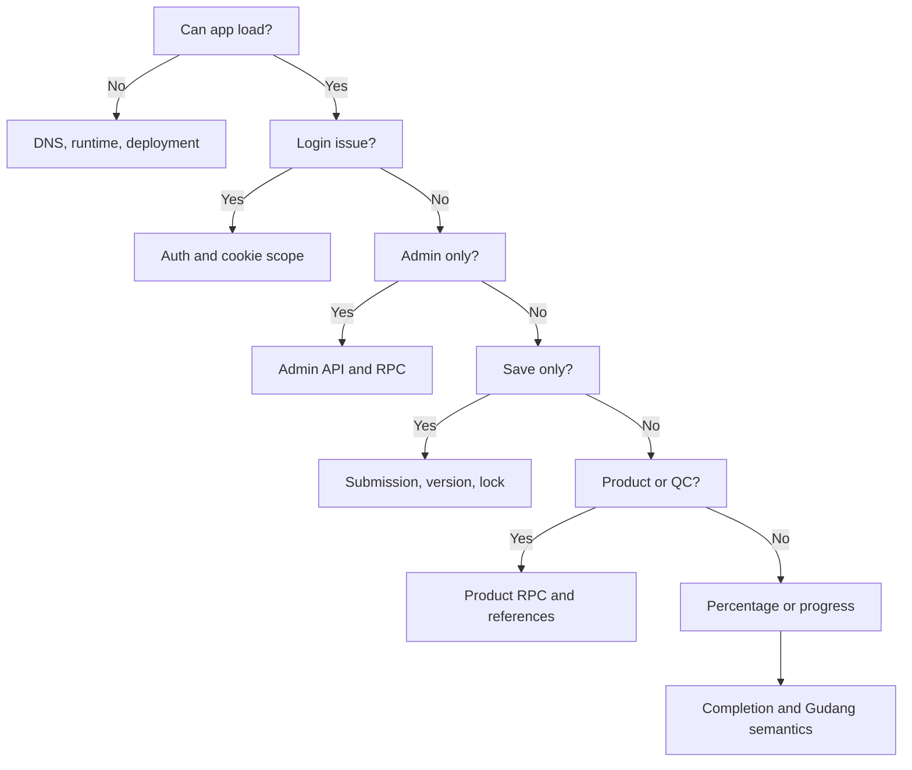

# Troubleshooting

## Status Dokumen

- Baseline source: `f5b4c1a7248b3da680fff7b19750fcfd00ec40a4`
- Target pembaca: Developer/Operator Aloptama Collect
- Source of truth: source code, configuration, tests, migrations, dan fakta operator yang secara eksplisit ditandai

## Cara Menggunakan Dokumen Ini

Mulai dari gejala, tentukan layer, lakukan cek read-only pertama, kumpulkan bukti minimum, lalu lanjut ke dokumen domain. Jangan menjadikan UPDATE, DELETE, atau edit payload manual sebagai langkah diagnosis pertama.

## Triage 5 Menit

### Login Tidak Bisa

**Kemungkinan layer:** Auth, cookie hostname, account mapping.
**Cek pertama:** URL host, response login, account/station scope, dan apakah masalah hanya setelah perpindahan legacy ke canonical.
**Kumpulkan:** waktu, hostname, role, status 401/403 tanpa token.
**Jangan lakukan:** reset/rotate credential sebagai respons pertama.
**Lanjut ke:** [Auth](./06-AUTH-DAN-OTORISASI.md).

### 401 / 403 API

**Kemungkinan layer:** sesi, role, RLS/RPC authorization.
**Cek pertama:** bedakan unauthenticated 401 dengan forbidden 403; cek endpoint/RPC dan role user.
**Jangan lakukan:** mengganti policy atau memakai service key dari browser.

### Station Tidak Melihat Site yang Benar

**Kemungkinan layer:** master Supabase, station scope, Site active, runtime mapping.
**Cek pertama:** bandingkan UUID station/site authoritative dan active state; jangan cocokkan nama saja.
**Jangan lakukan:** regenerate generated master atau edit Submission sebagai solusi cepat.
**Lanjut ke:** [Arsitektur](./02-ARSITEKTUR.md) dan [Submission](./07-FLOW-STATION-DAN-SUBMISSION.md).

### Submission Tidak Bisa Dibuka

**Kemungkinan layer:** route context, submission/site/subtype identity, payload load.
**Cek pertama:** identifikasi `submission_id`, station/site/subtype UUID, archived state, dan response server.
**Jangan lakukan:** browser reload sebagai perbaikan permanen atau edit payload manual.

### Autosave Gagal

**Kemungkinan layer:** network, version, lock, RPC.
**Cek pertama:** error response, version current, session lock, dan apakah final save atau autosave.
**Jangan lakukan:** force release lock atau overwrite version tanpa audit.
**Lanjut ke:** [Submission](./07-FLOW-STATION-DAN-SUBMISSION.md).

### Version Conflict

**Kemungkinan layer:** optimistic versioning.
**Cek pertama:** bandingkan version client/current dan payload latest.
**Jangan lakukan:** memaksa save lama menimpa data terbaru.

### Submission Terkunci

**Kemungkinan layer:** soft lock/session activity.
**Cek pertama:** pemilik lock, session, last activity, dan timeout contract.
**Jangan lakukan:** release semua lock satu account atau mengubah timeout lima menit tanpa perubahan domain yang disetujui.

### Admin Ringkasan Lambat / Gagal

**Kemungkinan layer:** Admin API/RPC, payload aggregation, deployment runtime.
**Cek pertama:** endpoint/RPC mana, auth vs query latency, dan apakah failure hanya completion.
**Jangan lakukan:** memuat semua payload ke browser atau menghapus authorization check.

### Completion Salah

**Kemungkinan layer:** expected master, inventory facts, completion RPC.
**Cek pertama:** Site/Subtipe expected, category expected/filled, status issue, dan whether Gudang terlibat.
**Jangan lakukan:** patch percent di UI.
**Lanjut ke:** [Completion dan Monitoring](./10-COMPLETION-DAN-MONITORING.md).

### Gudang Salah

**Kemungkinan layer:** Gudang semantics.
**Cek pertama:** bedakan coverage Submission Gudang dari completeness inventaris.
**Jangan lakukan:** menyimpulkan percent Gudang berasal dari unit/category count.

### QC Count Salah

**Kemungkinan layer:** paginated list vs aggregate summary RPC.
**Cek pertama:** bandingkan aggregate status RPC dengan list yang dipaginasi.
**Jangan lakukan:** menghitung total dari page client saja.

### Hasil List Hilang setelah 1.000 Baris

**Kemungkinan layer:** batas maksimum row PostgREST atau pagination tanpa urutan unik.
**Cek pertama:** bandingkan count database dengan jumlah row seluruh batch; pastikan setiap `.range()` memakai primary key sebagai tiebreaker terakhir.
**Jangan lakukan:** menaikkan batas global sebagai pengganti batching atau menganggap batch yang gagal sebagai nilai nol.

### Proposal REJECTED Terlihat Muncul Lagi

**Kemungkinan layer:** proposal berbeda dengan Brand/Model sama, status list, atau history QC.
**Cek pertama:** bandingkan proposal UUID, kategori/item, `created_at`, `reviewed_at`, audit `QC_REJECT`, DB status, status summary, dan list PENDING. UUID berbeda pada kategori berbeda bukan transisi REJECTED ke PENDING.
**Jangan lakukan:** mengubah semua proposal bernama sama menjadi REJECTED atau menghapus history.

### Approve Baru Gagal

**Kemungkinan layer:** canonical Product normalized sudah ada, proposal telah diproses, atau authorization.
**Cek pertama:** proposal UUID/status dan exact normalized Brand/Model canonical. Jika Product sudah ada, gunakan Gabungkan ini; jangan mencoba membuat duplicate canonical.
**Jangan lakukan:** menghapus Product existing atau melemahkan unique/duplicate guard.

### QC Merge Gagal

Jika Product canonical aktif ada di menu Produk tetapi tidak muncul pada Gabungkan ini, cek request `/api/admin/qc-merge-targets`, filter `active`/`merged_into_product_id`, dan hasil search server-side. Jangan kembali ke pola mengambil maksimal 1.000 Product lalu mencari di browser karena Product setelah batas tersebut tidak akan pernah ditemukan.

**Kemungkinan layer:** proposal bukan lagi PENDING, target tidak tersedia/inactive, atau target berubah karena Product Merge concurrent.
**Cek pertama:** proposal UUID/status, Product target UUID, dan canonical successor. Refresh queue bila reviewer lain sudah memproses proposal.
**Jangan lakukan:** update `resolved_product_id` manual atau mengabaikan stale conflict.

### Product Reference Salah

**Kemungkinan layer:** canonical product, direct JSON product ID, proposal resolution.
**Cek pertama:** product UUID canonical, direct occurrence, `resolved_product_id`, dan active/archived Submission.
**Jangan lakukan:** match berdasarkan Merk/Tipe saja.

### Merk/Tipe Lama Masih Terlihat Setelah Product Diedit

**Kemungkinan layer:** resolver tampilan masih memakai snapshot payload atau form belum memuat ulang canonical Product. **Cek pertama:** bandingkan `productId`/`resolved_product_id` dengan `products.id`, lalu muat ulang form secara authoritative. Snapshot payload dan nama usulan QC boleh tetap lama sebagai provenance. **Jangan lakukan:** rewrite massal `submissions.payload` atau mengubah proposal history hanya untuk menyamakan label.

### Pindahkan Referensi Gagal

**Kemungkinan layer:** dependency preflight, target canonical, transaction/RPC.
**Cek pertama:** dependency list, target UUID, stale/version guard, dan audit result.
**Jangan lakukan:** edit seluruh inventory JSON secara global.

### Product Merge Gagal

**Kemungkinan layer:** product dependency dan QC references.
**Cek pertama:** source/target UUID, aliases, product proposals resolved, direct references, dan transaction error.
**Jangan lakukan:** hard delete loser Product yang masih memiliki history/reference.

### Category Context Salah

**Kemungkinan layer:** inventory scan dan proposal context enrichment.
**Cek pertama:** active Submission, `productProposalId`, Site/Subtipe current, dan kategori yang dideduplikasi.
**Jangan lakukan:** menebak kategori dari label Product.

### Build Gagal

**Kemungkinan layer:** source, dependency, Node version, environment boundary.
**Cek pertama:** jalankan Node yang memenuhi `>=22.13.0`, `npm ci`, lalu `npm run build`; baca error pertama.
**Jangan lakukan:** mengabaikan build lulus lokal sebagai bukti runtime production.

### Hostinger Deployment Gagal

**Kemungkinan layer:** deployment build/runtime/environment.
**Cek pertama:** SHA `main`, status/log deployment, build vs runtime, dan nama env tanpa nilainya. Lihat [OP-011](./OPERATOR-INPUT-WORKSHEET.md) untuk lokasi log dashboard.
**Jangan lakukan:** ubah DNS terlebih dahulu.

### Legacy Vercel Redirect Salah

**Kemungkinan layer:** hostname redirect `proxy.ts`.
**Cek pertama:** legacy host exact, status 307, Location, path/query, lalu canonical host.
**Jangan lakukan:** menganggap Preview host harus redirect.

### Supabase RPC Error

**Kemungkinan layer:** migration/schema/signature/grant/RLS.
**Cek pertama:** nama RPC, error aman, migration history, dan oracle read-only.
**Jangan lakukan:** run write diagnostic atau edit applied migration.

### Local Supabase Tidak Jalan

**Kemungkinan layer:** Docker/Supabase CLI local.
**Cek pertama:** `npx supabase status`, container/port local, lalu `npx supabase start` bila diperlukan.
**Jangan lakukan:** mengarahkan verifier local ke production.

### UPT Tidak Dapat Membuka atau Menyimpan Form

**Kemungkinan layer:** status global **Akses Pengisian UPT** sedang DITUTUP,
status gagal dibaca, atau Station account/scope bermasalah.
**Cek pertama:** buka **Super Admin -> Ringkasan**, periksa status authoritative,
lalu lihat Audit Admin untuk transisi `UPT_DATA_ENTRY_CLOSED` terbaru. Bila tab
Station sudah terbuka sebelum penutupan, heartbeat atau save berikutnya memang
akan menghentikan edit.
**Expected:** Super Admin tetap dapat membuka data saat Station User diblokir.
**Jangan lakukan:** bypass dengan SQL, menonaktifkan akun Station, melepas semua
lock, atau mengubah Submission agar form dapat dibuka.

## Historical Incident Cards

### Product Proposal count lebih dari 1000

Penyebab historis adalah cap PostgREST pada list serta count client dari hasil paginasi. Perbaikan yang benar adalah aggregate RPC status dan server pagination, bukan menaikkan limit client.

### Completion performance

Penyebab historis adalah repeated global JSON traversal. Ringkasan set-based/combined menjaga perhitungan completion tanpa traversal payload global berulang.

### Product Merge QC references

Penyebab historis adalah dependency `resolved_product_id` belum seluruhnya ikut dipindahkan. Desain benar memindahkan QC reference secara atomic bersama merge canonical.

### Gudang

Progress Gudang adalah coverage distinct Station dengan Submission Gudang, bukan completeness inventaris Gudang.

## Escalation Checklist

Sertakan symptom, waktu, URL/route, SHA, role user, UUID yang relevan, response/error aman, tindakan yang sudah dicoba, dan apakah data production berisiko. Jangan sertakan token, header Authorization, connection string, atau payload penuh tanpa sanitasi.

## Source of Truth untuk Dokumen Ini

- `proxy.ts`, `app/lib/legacy-vercel-redirect.ts`, `supabase/migrations/`, RPC consumer, dan test/verifier terkait.
- [Auth](./06-AUTH-DAN-OTORISASI.md), [Submission](./07-FLOW-STATION-DAN-SUBMISSION.md), [Product](./09-PRODUCT-MASTER-DAN-REFERENSI.md), dan [Completion](./10-COMPLETION-DAN-MONITORING.md).

## Baca Sebelumnya

[Runbook Production](./13-RUNBOOK-PRODUCTION.md)

## Baca Selanjutnya

[Security dan Secrets](./15-SECURITY-DAN-SECRETS.md)
