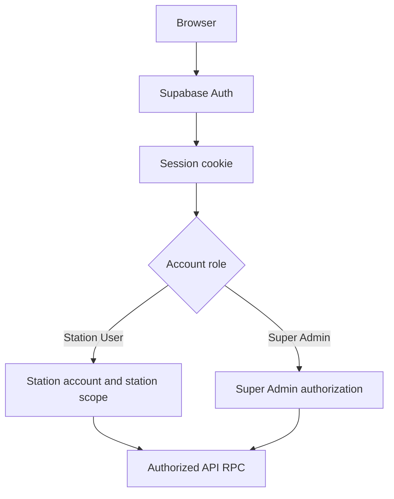

# Auth Flow Diagram

## Purpose

Show authentication separately from role and Station scope authorization.

## Diagram

## Important Invariants

- Soft lock is not authorization.
- Legacy and canonical host cookies are not shared.
- DB/RPC authorization remains a final boundary.

## Detailed Documentation

[Auth dan Otorisasi](../06-AUTH-DAN-OTORISASI.md)
