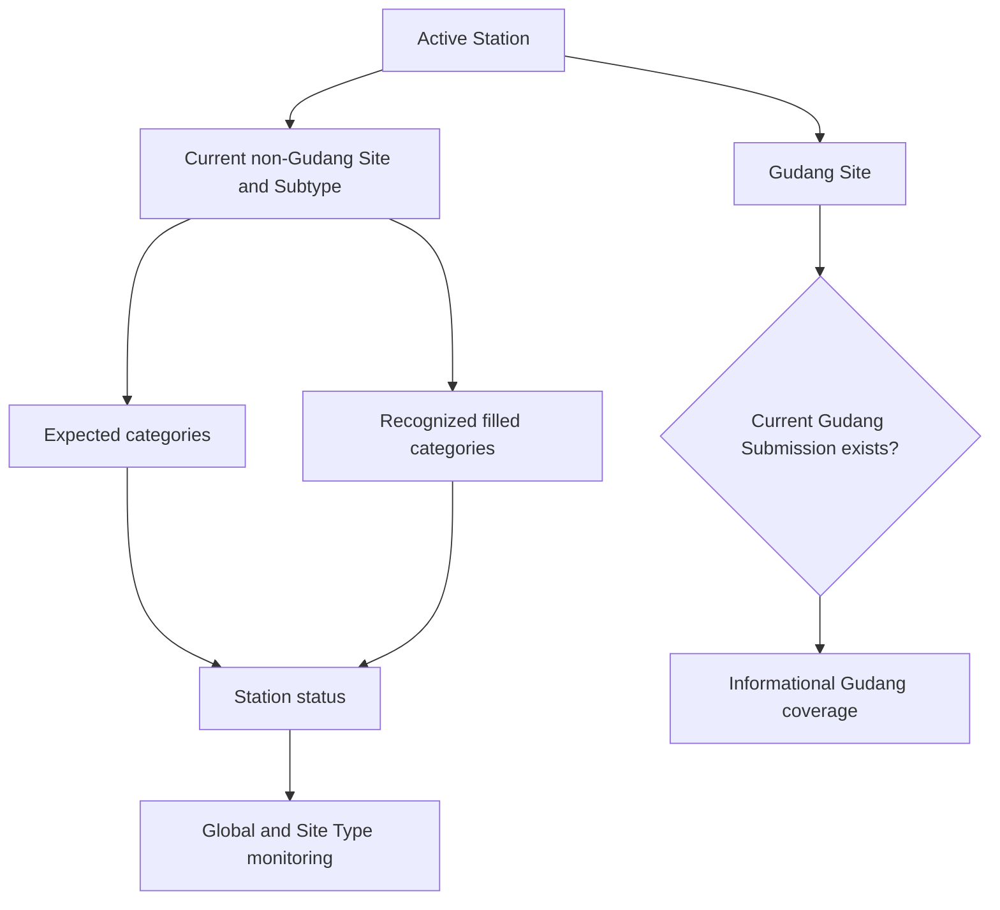

# Completion Flow Diagram

## Purpose

Separate normal Site/Subtipe category completeness from Gudang informational coverage.

## Diagram

## Important Invariants

- Gudang path does not enter expected/filled/global completion.
- Completion remains master-current and DB-authoritative.

## Detailed Documentation

[Completion dan Monitoring](../10-COMPLETION-DAN-MONITORING.md)
