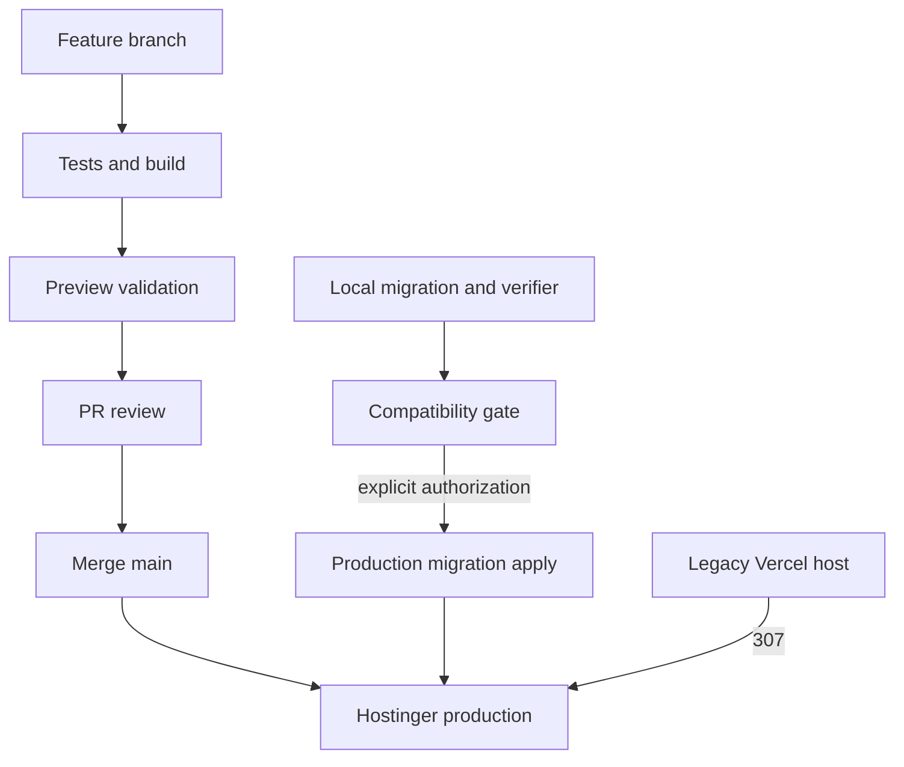

# Deployment Flow Diagram

## Purpose

Separate application deployment from database migration release steps.

## Diagram

## Important Invariants

- Migration is not application deployment.
- Production mutation needs explicit authorization.
- App rollback requires schema compatibility review.

## Detailed Documentation

[Deployment](../11-DEPLOYMENT-DAN-INFRASTRUKTUR.md), [Runbook](../13-RUNBOOK-PRODUCTION.md)
