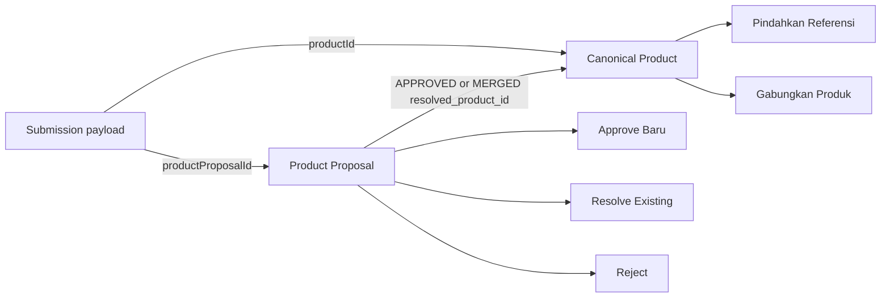

# Product QC Flow Diagram

## Purpose

Show dual Product references and QC/Product maintenance boundaries.

## Diagram

## Important Invariants

- DIRECT and QC_RESULT references have different mutation semantics.
- QC history survives canonical resolution and Product merge.
- Reject does not create a canonical Product.

## Detailed Documentation

[Admin dan QC](../08-FLOW-ADMIN-DAN-QC.md), [Product Master](../09-PRODUCT-MASTER-DAN-REFERENSI.md)
