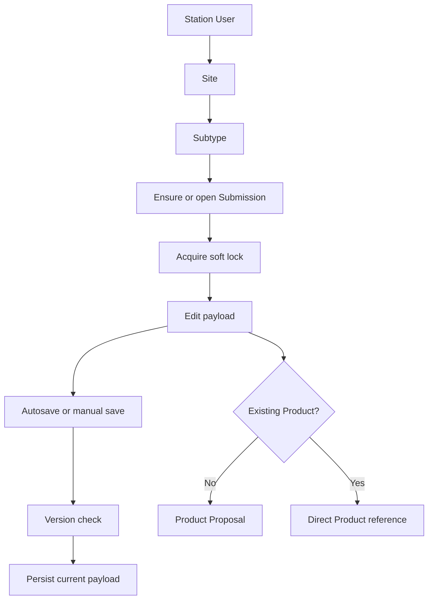

# Submission Flow Diagram

## Purpose

Show Station selection, lock lifecycle, save/versioning, and optional Product Proposal.

## Diagram

## Important Invariants

- Authorization determines access; soft lock coordinates editors.
- Payload-changing save follows version contract.
- Proposal is not automatically a canonical Product.

## Detailed Documentation

[Flow Station dan Submission](../07-FLOW-STATION-DAN-SUBMISSION.md)
