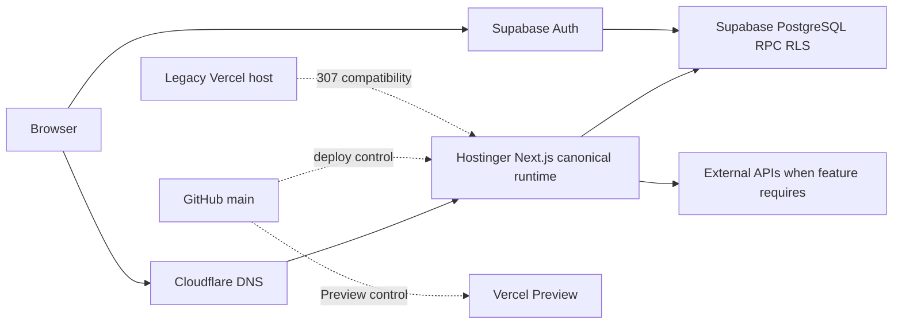

# System Architecture Diagram

## Purpose

Visualize runtime, control/deployment, and compatibility boundaries.

## Diagram

## Important Invariants

- Hostinger is canonical runtime; Cloudflare is DNS, not asserted as app host.
- Vercel legacy compatibility is separate from Preview.
- Supabase remains the data/Auth authority.

## Detailed Documentation

[Architecture](../02-ARSITEKTUR.md), [Deployment](../11-DEPLOYMENT-DAN-INFRASTRUKTUR.md)
